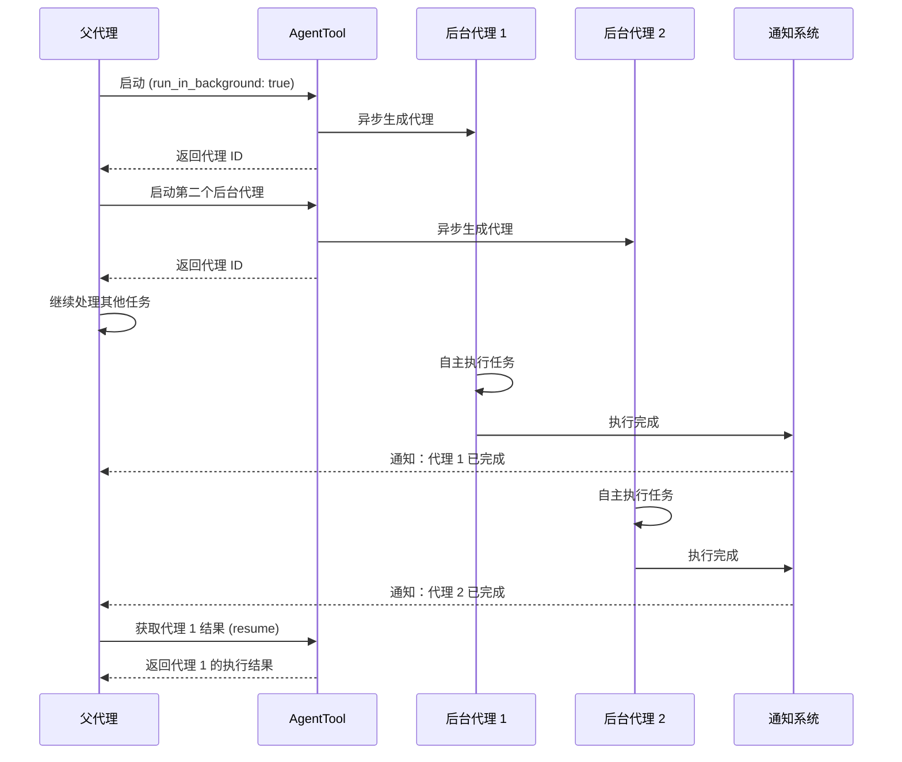
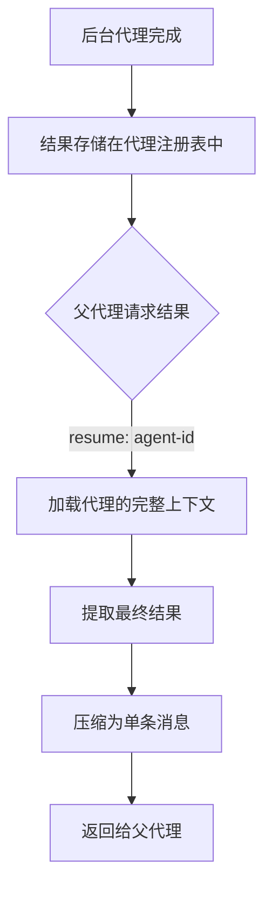
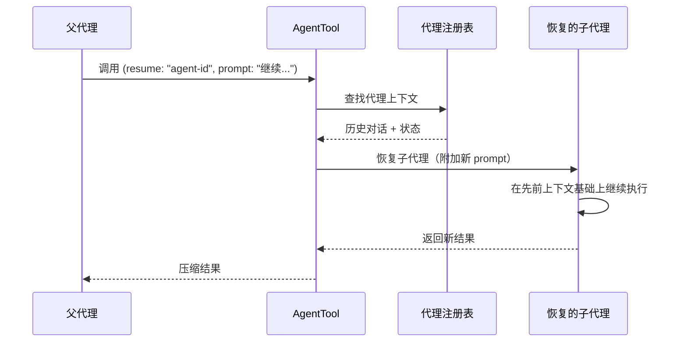

# 后台执行

**源码**：`src/tools/AgentTool/`

## 概述

后台执行允许父代理启动子代理后继续处理其他任务，而不必等待子代理完成。这使得多个子代理可以并行工作，极大提升了复杂任务的处理效率。后台代理还支持恢复机制，可以在后续轮次中重新连接到之前的代理实例。

## 后台代理生命周期

## 启动机制

后台代理通过 `run_in_background: true` 参数启动：

1. **代理创建** — 与同步代理相同的创建流程（prompt 构建、工具过滤、上下文隔离）
2. **异步分离** — 代理在独立的执行上下文中启动，不阻塞父代理
3. **ID 返回** — 立即返回代理 ID，父代理可用此 ID 后续查询或恢复
4. **状态追踪** — 系统维护一个后台代理注册表，跟踪每个代理的状态

后台代理与同步代理的核心区别在于控制流——后台代理不会阻塞父代理的执行循环。

## 通知系统

后台代理完成时，通知系统向父代理发送完成通知：

- **完成通知** — 代理正常完成时发送成功通知
- **错误通知** — 代理执行失败时发送错误信息
- **状态查询** — 父代理可以主动查询后台代理的当前状态
- **非阻塞** — 通知不会中断父代理当前的工具调用

通知以系统消息的形式注入到父代理的对话流中，确保父代理在下一轮对话时能够感知到后台代理的状态变化。

## 并行执行

多个后台代理可以同时运行，实现任务的并行处理：

| 场景 | 推荐方式 |
|------|---------|
| 独立文件修改 | 多个 worktree 隔离的后台代理 |
| 只读分析任务 | 多个共享 CWD 的后台代理 |
| 有依赖的任务 | 串行启动，前一个完成后启动下一个 |
| 混合读写 | Worktree 隔离 + 最终合并 |

并行代理的最大数量受系统资源和 API 速率限制约束。

## 结果获取

后台代理的结果通过 `resume` 参数获取：

结果获取是幂等的——同一个代理的结果可以被多次获取。

## 恢复机制

`resume` 参数不仅用于获取结果，还可以恢复一个之前的代理实例继续执行：

### 恢复流程

恢复的关键特性：

- **完整上下文** — 恢复的代理保留其所有先前的对话历史和工具调用结果
- **新指令** — 可以通过 `prompt` 参数向恢复的代理提供新的指令
- **状态延续** — 代理的工具状态、CWD、权限等全部延续
- **迭代工作流** — 支持多次恢复同一代理，实现渐进式任务完成

## 资源管理

后台代理的资源管理策略：

- **内存** — 每个后台代理维护独立的对话历史，占用独立内存
- **API 配额** — 并行代理共享同一 API 配额，可能触发速率限制
- **Worktree** — 后台代理使用的 worktree 在代理结束后需要清理
- **超时** — 后台代理同样受超时机制约束，长时间未完成会被终止
- **清理** — 会话结束时，所有未完成的后台代理会被优雅终止

## 设计模式

- **异步模式（Promise）** — 后台代理的启动-等待-获取结果模型类似于 Promise 的 resolve 流程
- **观察者模式** — 通知系统允许父代理订阅后台代理的状态变化事件
- **备忘录模式** — 恢复机制通过保存和还原代理的完整状态快照来实现上下文延续

## 相关页面

- [概述](./index) — Agent 工具概述
- [代理生命周期](./agent-lifecycle) — 子代理完整生命周期
- [隔离与 Worktree](./isolation-and-worktrees) — 文件系统隔离机制
