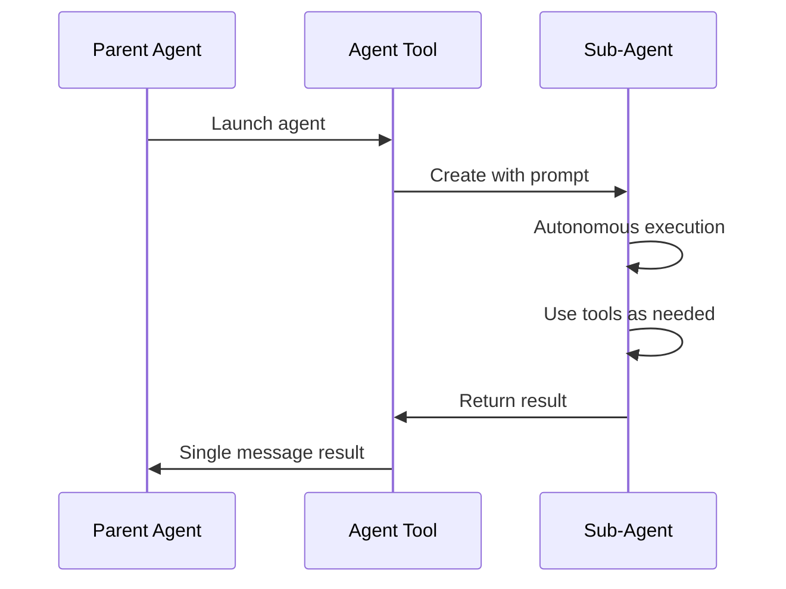

# Agent 工具

**源码**: `src/tools/AgentTool/`

## 概述

Agent 工具使 Claude Code 能够生成子代理 — 独立的 Claude 实例，自主处理复杂的多步骤任务。这是多代理架构的基础。

## 参数

- **prompt** — 子代理的任务描述
- **description** — 简短（3-5 词）摘要
- **subagent_type** — 代理专业化类型（可选）
- **run_in_background** — 异步运行（可选）
- **isolation** — 隔离模式，如 `"worktree"`（可选）
- **resume** — 要恢复的代理 ID（可选）

## 代理类型

| 类型 | 可用工具 | 使用场景 |
|------|---------|---------|
| `general-purpose` | 所有工具 | 复杂多步骤任务 |
| `Explore` | 只读工具 | 代码库探索 |
| `Plan` | 只读工具 | 实现规划 |
| `statusline-setup` | Read, Edit | 状态栏配置 |

## 执行模型

## 隔离模式

### 默认
子代理与父代理在同一目录工作。

### Worktree
`isolation: "worktree"` 创建临时 git worktree，给子代理一个隔离的仓库副本。更改可以保留或丢弃。

## 后台执行

代理可以在后台运行，父代理继续工作：

- 使用 `run_in_background: true` 启动
- 代理完成时通知父代理
- 多个代理可以并行运行

## 恢复代理

代理可以使用其 ID 恢复，保留完整的先前上下文。这使得跨多个回合的迭代工作流成为可能。

## 深入阅读

- [代理生命周期](./agent-lifecycle) — 完整生命周期：prompt 构建、工具过滤、执行上下文
- [隔离与 Worktree](./isolation-and-worktrees) — Git worktree 创建、清理和文件系统隔离机制
- [后台执行](./background-execution) — 异步代理执行、通知系统、并行协调和恢复机制
