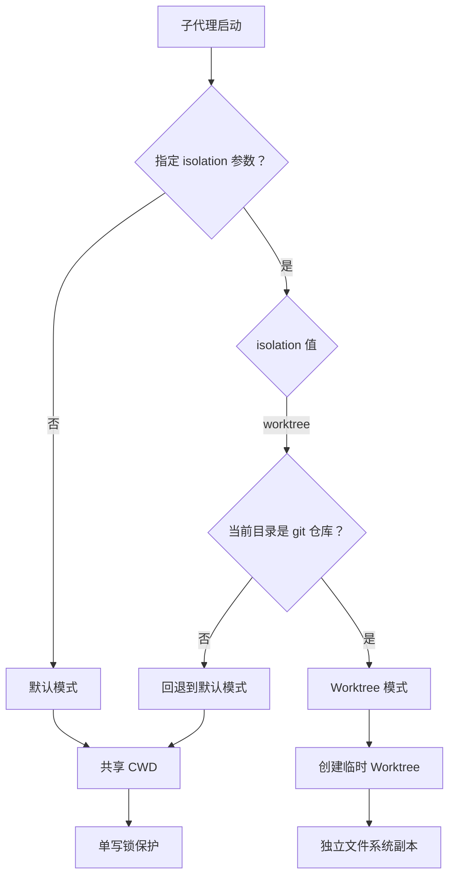
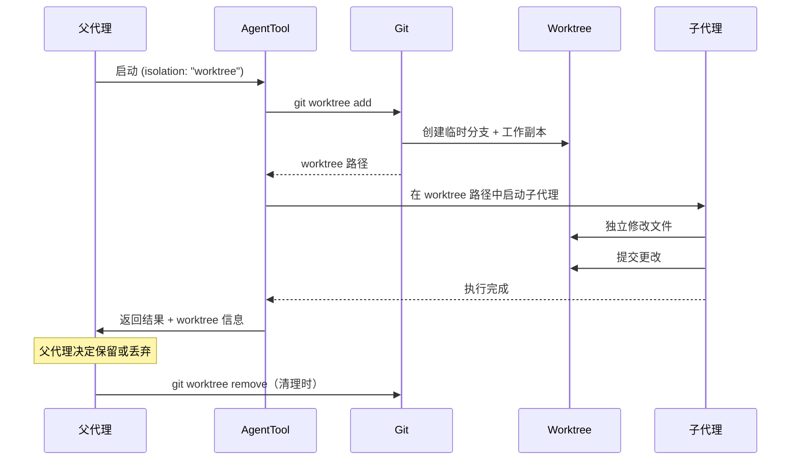
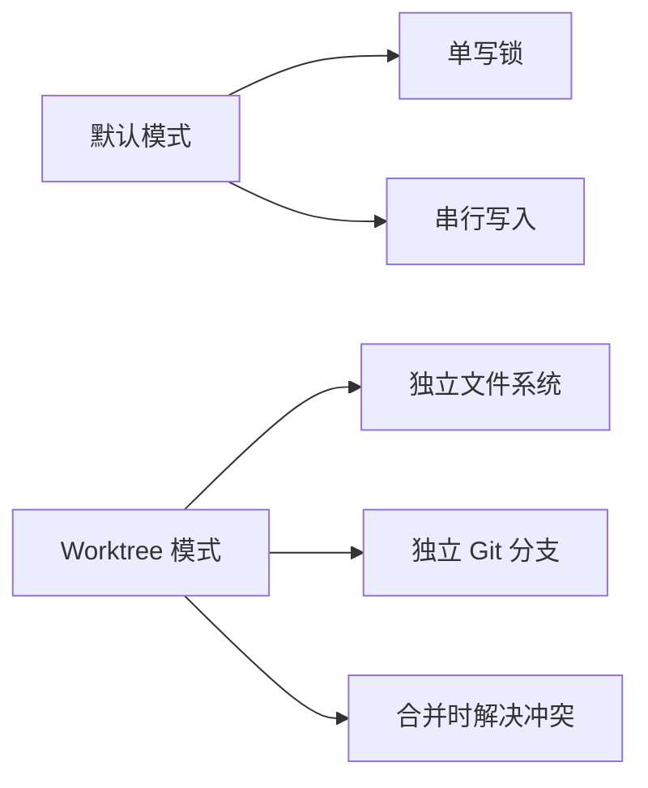

# 隔离与 Worktree

**源码**：`src/tools/AgentTool/`

## 概述

子代理的隔离机制决定了它如何与父代理共享（或不共享）文件系统。Claude Code 提供两种隔离模式：默认的共享目录模式和基于 git worktree 的完全隔离模式。选择合适的隔离模式对于防止并行代理之间的文件冲突至关重要。

## 隔离模式决策



## 默认模式

默认模式下，子代理与父代理共享同一个工作目录（CWD）：

- **共享文件系统** — 子代理可以读写父代理的工作目录中的所有文件
- **单写锁** — 当子代理执行写操作时，通过锁机制防止父代理同时写入同一文件
- **即时可见** — 子代理的文件修改立即对父代理可见
- **适用场景** — 简单任务、需要即时反馈的场景

单写锁是防止文件冲突的关键机制。当一个代理（父或子）正在写入文件时，其他代理的写操作会被阻塞，直到锁释放。

## Worktree 模式

当传入 `isolation: "worktree"` 时，系统创建一个临时 git worktree，为子代理提供完全隔离的文件系统：

### Worktree 生命周期



### Worktree 创建细节

Worktree 的创建过程包含以下步骤：

1. **分支创建** — 基于当前 HEAD 创建一个临时分支（如 `agent-worktree-<uuid>`）
2. **目录分配** — 在 `.claude/worktrees/` 目录下创建 worktree
3. **文件复制** — Git 将当前提交的文件检出到 worktree 目录
4. **CWD 切换** — 子代理的工作目录设置为 worktree 路径

```
项目根目录/
├── .git/
├── .claude/
│   └── worktrees/
│       └── agent-worktree-a1b2c3/    ← 子代理的隔离副本
│           ├── src/
│           ├── package.json
│           └── ...
├── src/                               ← 父代理的工作目录
└── package.json
```

### 文件系统隔离

Worktree 模式提供的隔离保证：

| 方面 | 行为 |
|------|------|
| 文件读取 | 子代理读取 worktree 中的文件副本 |
| 文件写入 | 修改仅影响 worktree，不影响主工作目录 |
| Git 操作 | 子代理可以在 worktree 中独立提交 |
| 新文件 | 创建在 worktree 目录中 |
| 已跟踪文件 | 来自创建时刻的 HEAD 快照 |
| 未跟踪文件 | 不会被复制到 worktree |

## 清理机制

Worktree 的清理遵循以下策略：

- **正常完成** — 子代理完成后，父代理可选择合并或丢弃 worktree 中的更改
- **异常终止** — 如果子代理崩溃或超时，worktree 会被标记为待清理
- **会话结束** — 会话退出时，未清理的 worktree 通过 `git worktree prune` 清理
- **手动清理** — 用户可以手动执行 `git worktree remove` 清理残留的 worktree

## 冲突预防

隔离机制从多个层面预防文件冲突：



- **默认模式** — 依赖单写锁实现串行写入，适合单个子代理
- **Worktree 模式** — 通过物理文件隔离避免冲突，适合并行多个子代理
- **合并阶段** — Worktree 的更改在合并回主分支时可能产生冲突，需要人工解决

## 设计模式

- **模板方法模式** — 隔离模式定义了子代理启动的骨架流程（创建上下文 → 设置 CWD → 启动代理 → 清理），具体步骤由各模式实现
- **RAII 模式** — Worktree 作为资源在创建时获取、在销毁时释放，确保临时 worktree 不会泄漏

## 相关页面

- [概述](./index) — Agent 工具概述
- [代理生命周期](./agent-lifecycle) — 子代理完整生命周期
- [后台执行](./background-execution) — 异步执行与并行协调
