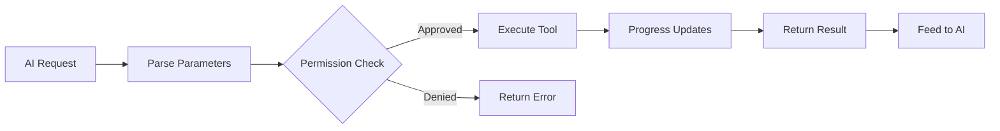

# 工具系统

**源码**: `src/Tool.ts` (792 行) 和 `src/tools/`（45+ 子目录）

## 概述

工具是 Claude Code 与用户环境交互的主要机制。每个工具都有定义的接口、输入模式和执行行为。

## 工具接口

每个工具实现 `src/Tool.ts` 中定义的标准接口：

- **name** — 唯一标识符（如 `"Bash"`、`"Read"`、`"Edit"`）
- **description** — AI 使用的自然语言描述
- **inputSchema** — 定义接受参数的 JSON Schema
- **execute** — 执行工具操作的异步函数
- **permissions** — 所需的权限级别

## 工具生命周期

## 工具分类

| 分类 | 工具 | 描述 |
|------|------|------|
| **文件操作** | Read, Edit, Write, Glob, Grep | 文件系统交互 |
| **执行** | Bash, PowerShell, REPL | 命令执行 |
| **AI 代理** | Agent, Coordinator | 多代理委派 |
| **扩展** | MCP, Skill | 外部工具集成 |
| **任务** | TaskCreate, TaskUpdate, TaskGet, TaskList, TaskStop | 任务管理 |
| **规划** | EnterPlanMode, ExitPlanMode | 结构化规划工作流 |
| **工作区** | EnterWorktree, ExitWorktree | Git worktree 隔离 |
| **笔记本** | NotebookEdit | Jupyter 笔记本支持 |
| **其他** | AskUserQuestion, Sleep, ScheduleCron | 实用工具 |

## 输入模式

工具使用 JSON Schema（`ToolInputJSONSchema`）定义参数。此模式作为工具定义的一部分发送给 AI，使 AI 能够构造有效的工具调用。

## 进度追踪

工具在执行过程中通过 `ToolProgressData` 发出进度事件。不同工具类型有专门的进度类型：

- `BashProgress` — Shell 命令输出流
- `MCPProgress` — MCP 服务器通信状态
- `SkillToolProgress` — 技能执行步骤
