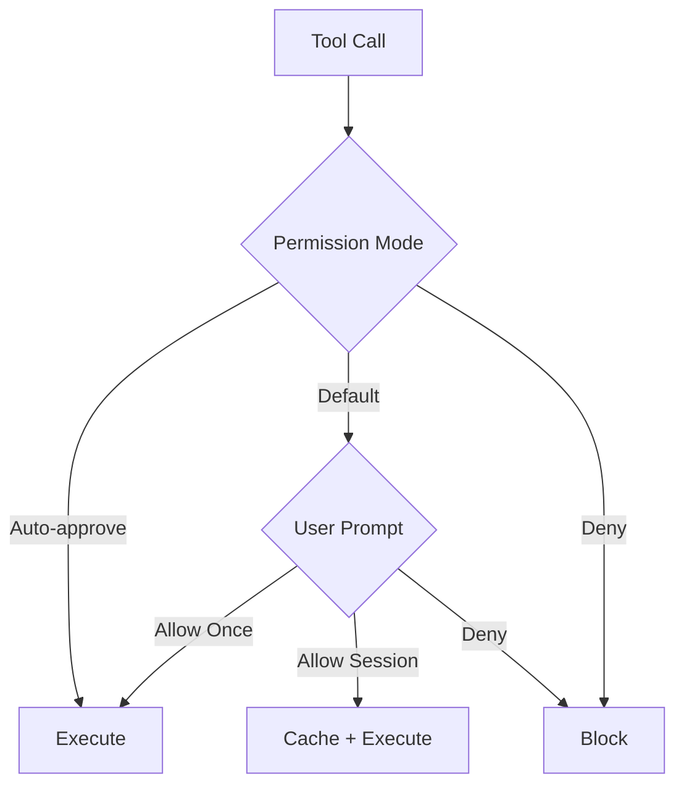

# 工具权限

**源码**: `src/types/permissions.ts` 和 `src/hooks/toolPermission/`

## 概述

Claude Code 实现了细粒度的权限系统，控制哪些工具可以执行以及在什么条件下执行。这在保障用户安全的同时维持了生产力。

## 权限模式

| 模式 | 行为 |
|------|------|
| **默认** | 每次工具使用都请求批准 |
| **自动批准** | 自动批准匹配的工具 |
| **拒绝** | 阻止工具执行 |

## 权限流程

## 权限上下文

每次权限检查包含 `ToolPermissionContext`：

- 工具名称和参数
- 工具是只读还是写入
- 正在执行的具体操作
- 先前的权限决策

## 权限 Hooks

`src/hooks/toolPermission/` 目录包含用于权限管理的 React hooks：

- **useCanUseTool** — 检查工具是否可用
- **useToolPermission** — 请求和缓存权限
- 权限状态存储在 AppState 中

## 安全规则

权限系统强制执行内置安全规则：

- 破坏性操作（rm -rf、git reset --hard）需要明确批准
- 项目目录外的文件写入会被标记
- 密钥文件（.env、credentials）受到保护
- 远程操作（push、deploy）需要确认

## 深入阅读

- [权限评估](./permission-evaluation) — 完整权限检查管道：模式解析、规则匹配和缓存
- [权限 Hooks](./permission-hooks) — Shell hook 执行、参数修改和自定义策略
- [安全规则](./safety-rules) — 内置安全规则、破坏性操作检测和机密文件保护
