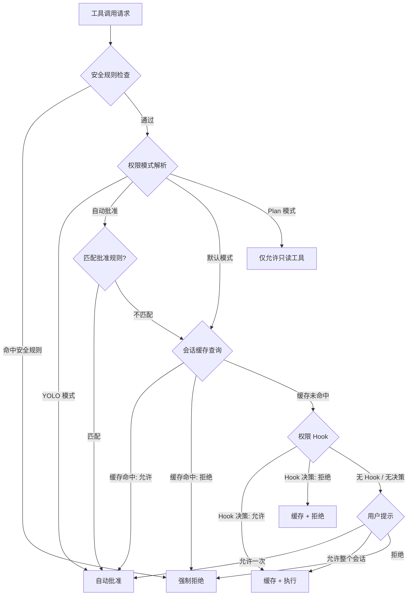
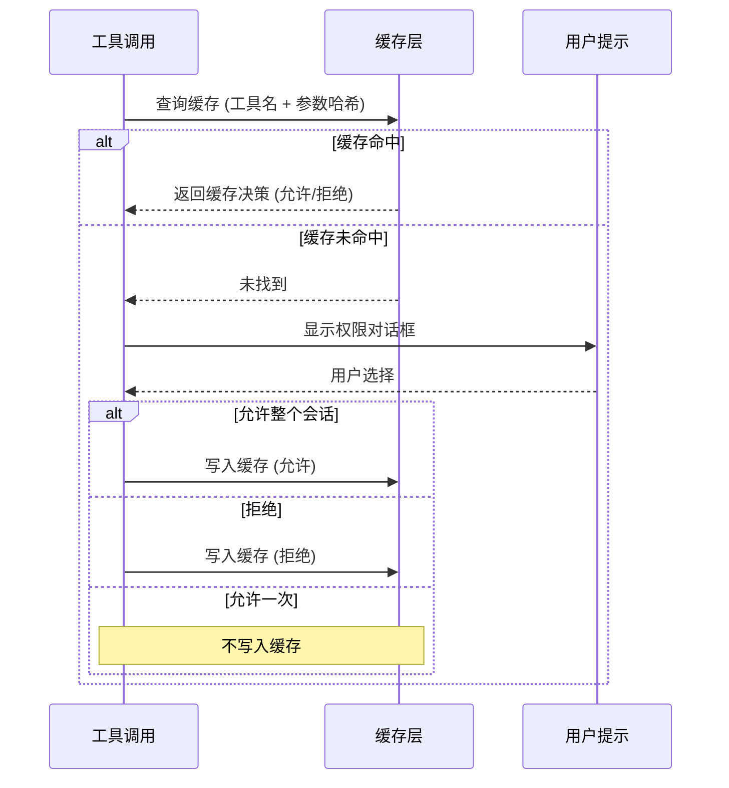

# 权限评估

**源码**：`src/types/permissions.ts` 和 `src/hooks/toolPermission/`

## 概述

权限评估是工具执行前的关键守门环节。系统通过多阶段管道——模式解析、规则匹配、会话缓存——对每一次工具调用做出允许或拒绝的决策。理解这条管道是掌握权限系统行为的基础。

## 完整决策树



## 权限模式

系统支持四种权限模式，按优先级从高到低排列：

| 模式 | 触发方式 | 行为 |
|------|---------|------|
| **YOLO 模式** | `--dangerously-skip-permissions` | 跳过所有权限检查，全部自动批准 |
| **Plan 模式** | `--plan` 或 plan 命令 | 仅允许只读工具（Read、Glob、Grep） |
| **自动批准** | `settings.json` 中的 `allowedTools` | 匹配的工具自动批准，其余走默认流程 |
| **默认** | 无特殊配置 | 每次工具使用都询问用户 |

### 模式解析

模式通过以下来源解析，优先级递减：

1. **CLI flags** — `--dangerously-skip-permissions`、`--plan`
2. **环境变量** — `CLAUDE_AUTO_APPROVE_TOOLS`
3. **settings.json** — `allowedTools` 数组配置
4. **默认值** — 未配置时使用默认模式

## 规则匹配

`allowedTools` 中的规则支持三种匹配模式：

```typescript
// 精确匹配
"Bash(npm test)"

// Glob 模式
"Edit(**/src/**)"

// 正则表达式
"Bash(/^git (status|log|diff)/)"
```

匹配按顺序进行，首条命中的规则决定结果。如果没有规则命中，回退到默认行为（询问用户）。

规则匹配的输入不仅是工具名称，还包含工具参数的序列化形式。例如 `Bash(npm test)` 表示工具名为 `Bash`、命令参数为 `npm test` 的调用。

## 会话缓存

当用户选择"允许整个会话"时，该决策被缓存以避免重复询问：

### 缓存键结构

```
工具名称 + 参数哈希 → 缓存决策
```

缓存键由工具名称和参数的标准化哈希组成。相同工具、相同参数的调用复用同一缓存条目。

### 缓存决策流程



### 缓存失效

缓存在以下场景下失效：

- **会话结束** — 缓存仅存活于当前会话
- **权限模式变更** — 切换模式时清空缓存
- **手动重置** — 用户可通过 `/permissions` 命令重置

## 权限上下文

每次权限检查携带完整的上下文信息：

```typescript
interface ToolPermissionContext {
  toolName: string;           // 工具名称
  toolParameters: unknown;    // 工具参数
  isReadOnly: boolean;        // 是否为只读操作
  action: string;             // 具体动作描述
  previousDecisions: Map<string, Decision>; // 历史决策缓存
  permissionMode: PermissionMode;           // 当前权限模式
}
```

这个上下文对象贯穿整个评估管道，每个阶段都可以读取并基于此做出决策。

## 设计模式

- **责任链** — 评估管道的各阶段（安全规则 → 模式检查 → 缓存 → Hook → 用户提示）形成责任链，请求沿链传递直到某一环节做出决策
- **策略模式** — 权限模式作为策略，决定了评估的行为——YOLO 策略全部放行，Plan 策略仅允许只读
- **旁路缓存** — 会话缓存实现了经典的旁路缓存模式：先查缓存，未命中则执行完整流程并回填缓存

## 相关页面

- [概述](./index) — 工具权限概述
- [权限 Hooks](./permission-hooks) — Shell hook 执行和自定义策略
- [安全规则](./safety-rules) — 内置安全规则和破坏性操作检测
