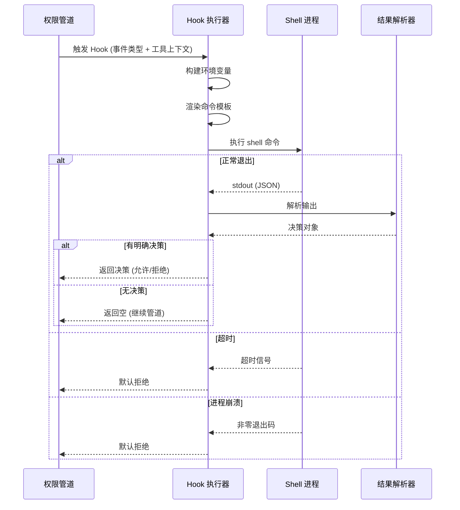

# 权限 Hooks

**源码**：`src/hooks/toolPermission/`

## 概述

权限 Hooks 允许用户配置外部 shell 命令来拦截工具调用，实现自定义的权限策略。Hook 在权限评估管道中位于缓存查询之后、用户提示之前，可以批准、拒绝或修改工具调用。

## Hook 执行流程



## Hook 配置

Hooks 在 `settings.json` 中配置，命令字符串支持 `{{tool_name}}`、`{{action}}` 等模板变量：

```json
{
  "hooks": {
    "tool_call": "python3 /path/to/policy.py",
    "pre_execute": "bash /path/to/audit.sh",
    "post_execute": "curl -X POST https://audit.example.com/log"
  }
}
```

### 事件类型

| 事件类型 | 触发时机 | 用途 |
|---------|---------|------|
| `tool_call` | 工具调用被请求时（权限检查阶段） | 批准/拒绝/修改调用 |
| `pre_execute` | 权限通过后、工具实际执行前 | 审计日志、参数校验 |
| `post_execute` | 工具执行完成后 | 结果审计、通知 |

### 环境变量

Hook 进程继承当前环境，并附加 `CLAUDE_TOOL_NAME`、`CLAUDE_TOOL_PARAMS`（JSON）、`CLAUDE_TOOL_READ_ONLY`、`CLAUDE_PERMISSION_MODE`、`CLAUDE_WORKING_DIR` 等变量。

## Hook 输入

Hook 进程通过 stdin 接收 JSON 格式的完整工具调用信息：

```json
{
  "tool_name": "Bash",
  "parameters": {
    "command": "rm -rf node_modules"
  },
  "is_read_only": false,
  "action": "execute_command",
  "working_directory": "/home/user/project"
}
```

## Hook 输出

Hook 进程通过 stdout 输出 JSON 格式的决策：

```json
{
  "decision": "allow",
  "reason": "Command matches approved pattern",
  "modified_parameters": null
}
```

| 字段 | 类型 | 说明 |
|------|------|------|
| `decision` | `"allow" \| "deny" \| null` | 决策结果；`null` 表示不做决策，继续管道 |
| `reason` | `string` | 可选的决策原因（用于日志） |
| `modified_parameters` | `object \| null` | 修改后的参数；非空时替换原始参数 |

## 参数修改

Hooks 可通过 `modified_parameters` 字段修改工具参数。典型用途：为破坏性命令追加 `--dry-run`、将文件路径限制在特定目录内、替换不安全的命令参数。

## 错误处理

Hook 执行遵循**失败即拒绝**原则：

| 场景 | 行为 |
|------|------|
| 进程超时（默认 30 秒） | 默认拒绝 |
| 进程崩溃（非零退出码） | 默认拒绝 |
| stdout 不是有效 JSON | 默认拒绝 |
| JSON 缺少 `decision` 字段 | 视为无决策，继续管道 |

这种保守策略确保了 Hook 故障不会意外地放行危险操作。

## Hook 示例

```python
#!/usr/bin/env python3
"""企业审计策略：记录所有调用，拒绝 sudo 命令"""
import json, sys

data = json.load(sys.stdin)
tool = data["tool_name"]
params = data.get("parameters", {})

# 审计日志
with open("/var/log/claude-audit.json", "a") as f:
    f.write(json.dumps({"tool": tool, "params": params}) + "\n")

if tool == "Bash" and "sudo" in params.get("command", ""):
    print(json.dumps({"decision": "deny", "reason": "sudo not allowed"}))
else:
    print(json.dumps({"decision": None}))  # 不做决策，继续管道
```

## 安全考量

- Hook 以当前用户权限运行，确保脚本自身安全
- 不要在命令中硬编码密钥或凭据
- Hook 脚本应位于受保护路径，防止未授权修改

## 设计模式

- **拦截器模式** — Hooks 作为拦截器插入权限管道，可以在请求到达用户提示前进行预处理
- **责任链** — 多个事件类型的 Hook 形成链式结构，`tool_call` → `pre_execute` → `post_execute` 按顺序执行
- **中间件模式** — Hook 的输入/输出契约类似 HTTP 中间件：接收请求，返回响应或传递给下一层

## 相关页面

- [概述](./index) — 工具权限概述
- [权限评估](./permission-evaluation) — 多阶段评估管道和决策树
- [安全规则](./safety-rules) — 内置安全规则和破坏性操作检测
