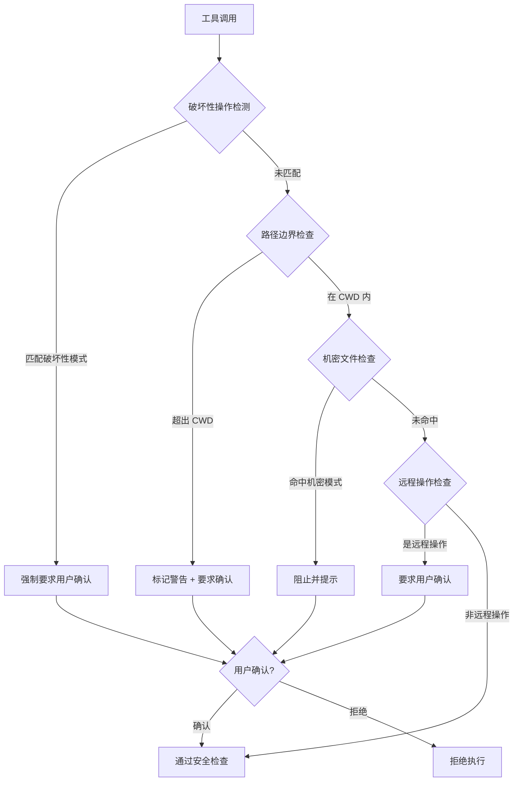

# 安全规则

**源码**：`src/types/permissions.ts`

## 概述

安全规则是权限系统中优先级最高的防线。这些内置规则在权限评估管道的最前端执行，早于模式检查和缓存查询，确保危险操作无论在何种权限模式下都不会被静默放行。

## 安全规则评估流程



## 破坏性操作检测

系统维护一组破坏性命令模式，匹配时强制要求用户确认：

```typescript
const destructivePatterns = [
  /rm\s+(-[rRf]+\s+|--recursive|--force)/,  // 递归/强制删除
  /git\s+reset\s+--hard/,                    // Git 硬重置
  /git\s+clean\s+-[fdx]/,                    // Git 清理未跟踪文件
  /git\s+push\s+.*--force/,                  // Git 强制推送
  /chmod\s+-R\s+777/,                        // 递归开放权限
  />\s*\/dev\/sd[a-z]/,                      // 写入块设备
];
```

破坏性检测仅针对 `Bash` 工具的命令参数。检测使用正则匹配，在命令执行前扫描命令字符串。

## 路径边界保护

文件操作工具（`Write`、`Edit`、`Bash`）受路径边界规则约束：

### CWD 检查

所有文件写入操作的目标路径必须位于当前工作目录（CWD）或其子目录内。超出 CWD 的操作被标记并要求确认。

### 符号链接解析

路径检查时会解析符号链接（`realpath`），防止通过符号链接绕过路径边界：

```
/project/data → (符号链接) → /etc/config
写入 /project/data/file.txt
↓ 解析符号链接
实际写入 /etc/config/file.txt → 超出 CWD，触发警告
```

## 机密文件保护

系统保护以下模式的文件免遭意外读写：

| 模式 | 示例 | 保护级别 |
|------|------|---------|
| `.env*` | `.env`, `.env.local`, `.env.production` | 读写均阻止 |
| `*credentials*` | `credentials.json`, `aws_credentials` | 读写均阻止 |
| `*private*key*` | `id_rsa`, `private_key.pem` | 读写均阻止 |
| `*secret*` | `client_secret.json`, `secrets.yaml` | 读写均阻止 |
| `*.pem` | `server.pem`, `ca-cert.pem` | 写入阻止 |
| `*token*` | `token.json`, `refresh_token` | 写入阻止 |

机密文件检测同时作用于文件路径和文件内容。当工具尝试将类似密钥的内容写入文件时，系统也会发出警告。

## 远程操作规则

涉及网络或远程服务的操作需要额外确认：

| 操作类型 | 匹配模式 | 说明 |
|---------|---------|------|
| Git 推送 | `git push` | 将代码推送到远程仓库 |
| 部署命令 | `deploy`, `publish` | 部署到生产环境 |
| 网络请求 | `curl -X POST`, `wget` | 发送数据到外部服务 |
| 包发布 | `npm publish`, `pip upload` | 发布包到公共注册表 |

## 规则分类

| 类别 | 规则目标 | 触发行为 | 可覆盖 |
|------|---------|---------|--------|
| **破坏性** | 不可逆的系统/数据操作 | 强制确认 | 仅 YOLO 模式 |
| **边界** | 超出 CWD 的文件操作 | 警告 + 确认 | 自动批准规则可覆盖 |
| **机密** | 密钥/凭据/环境变量文件 | 阻止 + 提示 | 仅 YOLO 模式 |
| **远程** | 网络/远程服务交互 | 要求确认 | 自动批准规则可覆盖 |

## 覆盖机制

不同权限模式对安全规则的覆盖能力不同：

- **YOLO 模式** — 覆盖所有安全规则（因此标注为 `dangerously`）
- **自动批准** — 可覆盖边界和远程规则，不可覆盖破坏性和机密规则
- **默认模式** — 不覆盖任何安全规则
- **Plan 模式** — 最严格，仅允许只读操作

## 规则组合

当多条安全规则同时命中时，采用**最严格优先**原则：

```
Bash("rm -rf /etc/config")
├── 破坏性操作：匹配 (强制确认)
├── 路径边界：超出 CWD (警告 + 确认)
└── 机密文件：可能匹配 (阻止)
结果 → 取最严格规则：阻止
```

系统不会因为某条规则允许就忽略另一条更严格的规则。

## 误报处理

安全规则可能产生误报（false positive）。用户可以通过以下方式处理：

1. **允许一次** — 对当前调用放行，不影响后续检查
2. **允许整个会话** — 缓存决策，同样的调用在本会话内不再提示
3. **添加自动批准规则** — 在 `settings.json` 的 `allowedTools` 中添加精确匹配规则
4. **权限 Hook** — 通过自定义 Hook 实现更细粒度的放行逻辑

建议优先使用精确匹配规则处理误报，避免使用过于宽泛的 glob 模式。

## 设计模式

- **策略模式** — 每类安全规则（破坏性/边界/机密/远程）是独立的策略对象，各自实现 `evaluate()` 方法
- **白名单与黑名单** — 机密文件使用黑名单模式（匹配即阻止），路径边界使用白名单模式（仅允许 CWD 内）
- **纵深防御** — 多层规则叠加检查，即使一层被绕过，下一层仍然生效

## 相关页面

- [概述](./index) — 工具权限概述
- [权限评估](./permission-evaluation) — 多阶段评估管道和决策树
- [权限 Hooks](./permission-hooks) — Shell hook 执行和自定义策略
