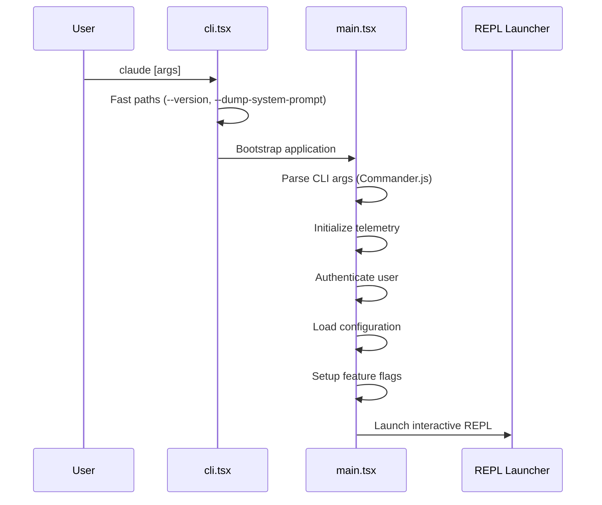

# 入口點

**原始碼**: `src/main.tsx` (4,683 行) 和 `src/entrypoints/cli.tsx`

## 引導流程

## CLI 入口 (`src/entrypoints/cli.tsx`)

最外層入口點處理：

- `--version` — 列印版本號並立即退出
- `--dump-system-prompt` — 輸出系統提示詞用於除錯
- MCP 伺服器模式 — 作為 MCP 伺服器啟動
- 守護程序工作模式 — 作為後臺守護程序執行
- 預設 — 進入完整應用引導流程

## 主入口 (`src/main.tsx`)

主入口點（4,683 行）負責編排：

### 1. CLI 引數解析
使用 Commander.js 定義命令列介面，選項包括：
- 模型選擇
- 許可權模式
- 會話恢復
- 輸出格式
- 特性標誌覆蓋

### 2. 服務初始化
- **遙測** — 分析和錯誤報告設定
- **認證** — API 金鑰或 OAuth 令牌驗證
- **配置** — 從 `~/.claude/` 載入設定
- **特性標誌** — 評估編譯時和執行時標誌

### 3. REPL 啟動
互動式讀取-求值-列印迴圈透過 `src/replLauncher.tsx` 啟動，初始化 React/Ink 渲染樹並進入互動模式。

### 4. 命令執行
如果提供了特定命令（如 `claude commit`），命令登錄檔（`src/commands.ts`）會直接解析並執行，而不進入 REPL。

## 其他入口點

| 入口 | 路徑 | 用途 |
|------|------|------|
| MCP 伺服器 | `src/entrypoints/mcp.ts` | 作為 MCP 工具伺服器執行 |
| 初始化 | `src/entrypoints/init.ts` | 首次初始化序列 |
| REPL 啟動器 | `src/replLauncher.tsx` | 互動式 UI 引導 |
