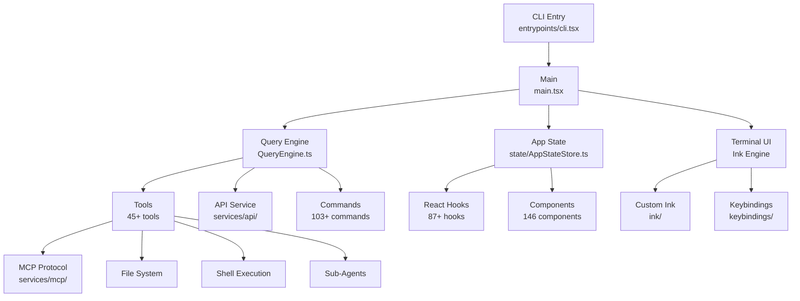

# 架構概述

Claude Code 是一個大型 TypeScript 應用，使用基於 React 的終端 UI。程式碼庫在 `src/` 下組織為 39 個頂層模組。

## 高層架構

## 核心模組

| 模組 | 路徑 | 描述 |
|------|------|------|
| 入口點 | `src/main.tsx` | CLI 解析、初始化、REPL 啟動 |
| 查詢引擎 | `src/QueryEngine.ts` | 核心 AI 查詢執行和工具編排 |
| 狀態 | `src/state/` | 中央應用狀態（AppState，23K+ 行） |
| 終端 UI | `src/ink/` | 自定義 Ink 渲染引擎（50+ 檔案） |
| 命令 | `src/commands/` | 103+ CLI 命令 |
| 工具 | `src/tools/` | 45+ 開發工具 |
| 服務 | `src/services/` | API、MCP、分析、LSP、OAuth |
| Hooks | `src/hooks/` | 87+ React hooks |
| 元件 | `src/components/` | 146 個 React 終端 UI 元件 |
| 工具函式 | `src/utils/` | 298+ 工具模組 |

## 資料流

1. 使用者輸入由基於 Ink 的終端 UI 捕獲
2. 輸入由查詢引擎處理，傳送到 Claude API
3. AI 響應可能包含工具呼叫，由工具系統執行
4. 工具結果反饋給 AI 進行進一步處理
5. 最終輸出透過 Ink 渲染管線呈現
6. 狀態變更透過 AppState 集中管理

## 關鍵設計決策

- **自定義 Ink 引擎**：對 Ink 的 fork/重新實現，以精確控制終端渲染
- **特性標誌**：編譯時程式碼消除，為不同功能集生成不同構建
- **MCP 協議**：透過 Model Context Protocol 標準實現擴充套件性
- **React 狀態模型**：集中式 AppState 配合 hooks 供元件訪問
