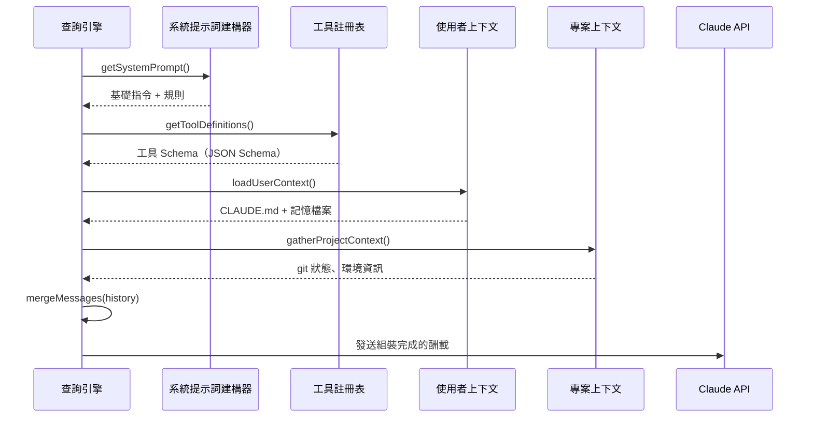
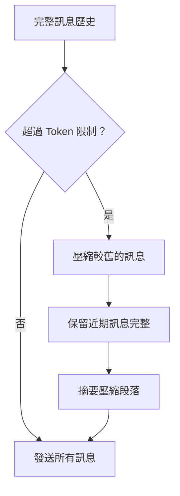

# 上下文組裝

**原始碼**：`src/query.ts` — `assembleContext()` 及相關函式

## 概述

在每次 API 呼叫之前，查詢引擎會從多個來源組裝豐富的上下文酬載。此流程決定了 Claude 在每個回合中「知道」什麼——系統提示詞、可用工具、對話歷史，以及專案特定的上下文。

## 組裝管線



## 系統提示詞組成

系統提示詞不是一個靜態字串——它是從多個層級動態組成的：

```
┌─────────────────────────────┐
│  基礎系統提示詞              │  ← src/constants/systemPrompt.ts
│  （核心代理指令）             │
├─────────────────────────────┤
│  工具指令                    │  ← 各工具的使用指引
├─────────────────────────────┤
│  專案上下文                  │  ← CLAUDE.md、.claude/ 設定
├─────────────────────────────┤
│  環境資訊                    │  ← 作業系統、shell、git 分支、cwd
├─────────────────────────────┤
│  啟用的功能                  │  ← feature flags、實驗功能
└─────────────────────────────┘
```

每個層級會根據當前會話狀態和設定來條件性地納入。

## 工具定義注入

工具以 JSON Schema 參數定義進行註冊。在上下文組裝期間：

1. **篩選** — 僅納入在當前權限模式下可用的工具
2. **轉換** — 將內部工具規格轉換為 Claude API 格式
3. **標注** — 加入快取控制標記以優化 prompt caching
4. **排序** — 將常用工具排在前面以提高快取效率

## 使用者上下文載入

使用者上下文檔案按照優先級鏈載入：

| 來源 | 優先級 | 範圍 |
|------|--------|------|
| `~/.claude/CLAUDE.md` | 1（最低） | 全域 |
| 專案根目錄 `CLAUDE.md` | 2 | 專案 |
| `.claude/settings.json` | 3 | 專案設定 |
| 記憶檔案（`~/.claude/memory/`） | 4（最高） | 會話持久 |

檔案在會話啟動時讀取並快取。會話期間的變更透過檔案監視器偵測。

## 訊息歷史管理

對話歷史需要妥善管理以維持在上下文限制之內：



關鍵行為：
- 近期訊息永遠不會被壓縮——它們包含活躍的上下文
- 工具結果會在訊息文字之前被截斷
- 系統提醒會在壓縮邊界處注入

## 快取控制策略

上下文組裝會在特定內容區塊標記 `cache_control`，以利用 Claude 的 prompt caching：

- 系統提示詞 → 快取（很少變動）
- 工具定義 → 快取（會話內為靜態）
- 使用者上下文 → 快取（不常變動）
- 對話歷史 → 不快取（每回合都會變動）

這可以在後續回合中為已快取的內容降低高達 90% 的 API 成本。

## 設計模式

- **建構器模式（Builder Pattern）** — 上下文透過建構器鏈逐步組裝
- **優先級鏈（Priority Chain）** — 多個上下文來源以優先級解析方式合併
- **延遲載入（Lazy Loading）** — 專案上下文僅在需要時才收集，不會預先計算

## 相關頁面

- [概述](./index) — 查詢引擎概述
- [串流處理管線](./streaming-pipeline) — 上下文發送至 API 後的後續處理
