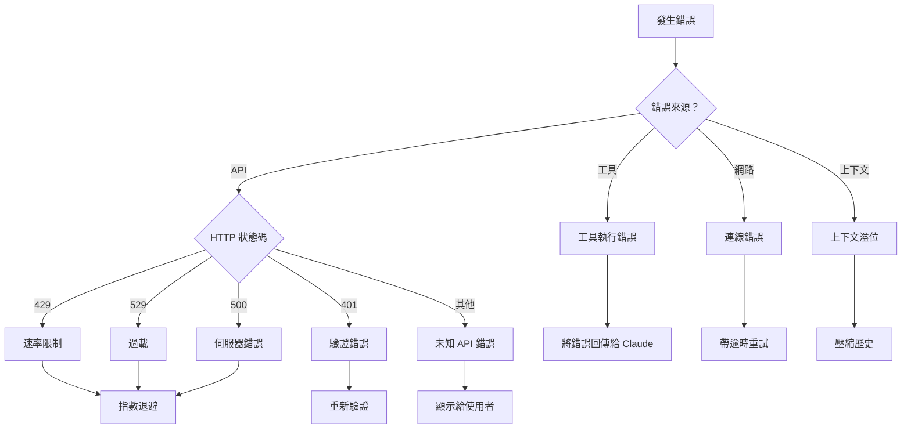
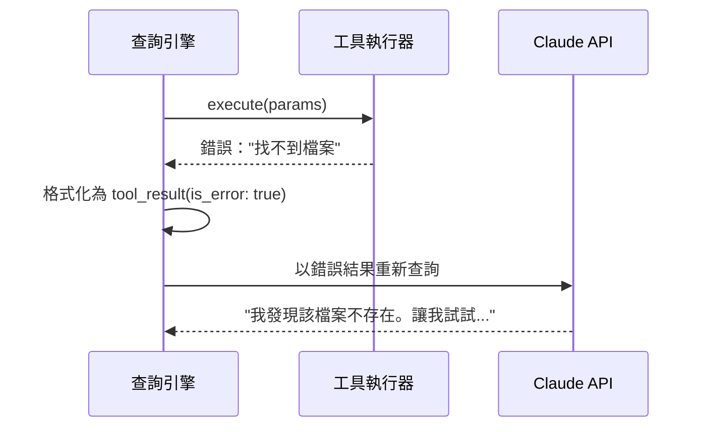
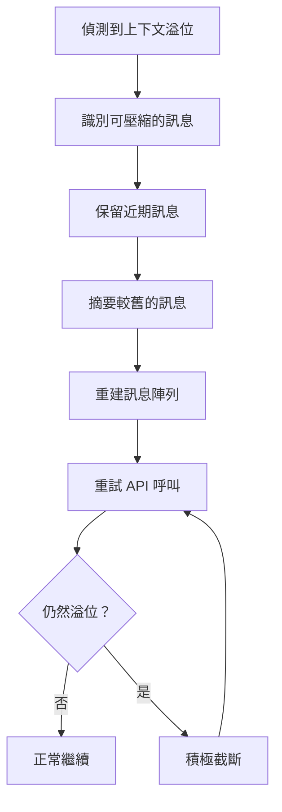

# 錯誤復原

**原始碼**：`src/query.ts` — 錯誤處理及 `src/services/claude.ts` — API 錯誤分類

## 概述

查詢引擎在多個層級處理錯誤——API 故障、速率限制、工具執行錯誤，以及上下文溢位。復原策略因錯誤類型而異，目標是在可能的情況下維持對話流程。

## 錯誤分類



## API 錯誤處理

### 速率限制（429 / 529）

速率限制錯誤會觸發指數退避重試策略：

```typescript
// 簡化的重試邏輯
const retryDelays = [1000, 2000, 4000, 8000, 16000]; // 毫秒

async function retryWithBackoff(fn, maxRetries = 5) {
  for (let i = 0; i < maxRetries; i++) {
    try {
      return await fn();
    } catch (err) {
      if (!isRetryable(err)) throw err;
      const delay = retryDelays[i] + jitter();
      await sleep(delay);
    }
  }
  throw new MaxRetriesError();
}
```

關鍵行為：
- 當存在 `Retry-After` 標頭時會予以遵守
- 隨機抖動（jitter）防止雷鳴群效應
- 使用者在退避期間會看到「正在重試...」的指示器
- 達到最大重試次數後，錯誤會顯示給使用者

### 驗證錯誤（401）

驗證失敗會觸發：
1. 嘗試 Token 重新整理（OAuth 流程）
2. 若重新整理失敗，提示使用者重新驗證
3. 會話狀態保留以供驗證後重試

### 伺服器錯誤（500）

伺服器錯誤被視為暫時性的，會以指數退避方式重試。對話狀態在重試期間保持不變。

## 工具執行錯誤

當工具失敗時，錯誤**不是**致命的——它成為對話的一部分：



這是一個關鍵的設計決策：工具錯誤是**給 Claude 的資訊**，而非程式崩潰。Claude 可以：
- 嘗試替代方案
- 向使用者要求釐清
- 跳過失敗的操作並繼續

## 上下文溢位復原

當對話超出上下文視窗時：



壓縮優先級（最先被移除的內容）：
1. 大型工具結果（檔案內容、指令輸出）
2. 較舊的助理訊息
3. 較舊的使用者訊息
4. 系統上下文（最後手段）

## 網路錯誤復原

連線失敗（逾時、DNS 錯誤等）的處理方式：

- 對暫時性錯誤立即重試
- 重試前進行連線健康檢查
- 向使用者顯示優雅降級訊息
- 保留會話狀態

## 錯誤邊界

查詢引擎使用錯誤邊界來防止級聯失敗：

| 邊界 | 捕獲 | 復原方式 |
|------|------|----------|
| API 呼叫 | HTTP 錯誤、逾時 | 指數退避重試 |
| 工具執行 | 執行時錯誤、崩潰 | 將錯誤回傳給 Claude |
| 串流處理 | 解析錯誤、格式異常事件 | 跳過事件，繼續串流 |
| 上下文組裝 | 檔案讀取錯誤、缺少設定 | 使用預設值，警告使用者 |

## 使用者介面錯誤訊息

錯誤會被轉譯為使用者友善的訊息：

- 技術細節會記錄在日誌中但不會顯示
- 盡可能提供可操作的建議
- 使用者始終知道發生了什麼失敗以及下一步該怎麼做

## 設計模式

- **斷路器（Circuit Breaker）** — 重複失敗會觸發冷卻期以防止 API 濫用
- **優雅降級（Graceful Degradation）** — 非關鍵路徑的錯誤不會導致會話崩潰
- **錯誤即資料（Error as Data）** — 工具錯誤成為對話上下文，而非例外

## 相關頁面

- [概述](./index) — 查詢引擎概述
- [工具呼叫迴圈](./tool-call-loop) — 產生工具錯誤的迴圈
- [串流處理管線](./streaming-pipeline) — 串流層級的錯誤處理
