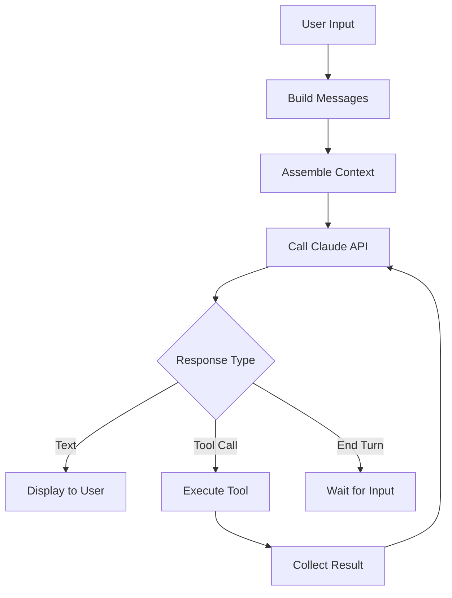

# 查詢引擎

**原始碼**: `src/QueryEngine.ts` (1,295 行) 和 `src/query.ts` (1,729 行)

查詢引擎是管理使用者、Claude AI 和工具之間對話迴圈的核心編排層。

## 職責

1. **訊息管理** — 構建和維護對話歷史
2. **API 通訊** — 以流式方式向 Claude API 傳送查詢
3. **工具呼叫處理** — 執行 AI 響應中的工具呼叫並將結果反饋
4. **上下文組裝** — 收集系統提示詞、使用者上下文和工具定義
5. **錯誤恢復** — 處理 API 錯誤、速率限制和工具失敗

## 查詢生命週期

## 上下文組裝

查詢引擎從多個來源組裝上下文：

- **系統提示詞** — Claude 的基礎指令（來自 `src/constants/`）
- **使用者上下文** — CLAUDE.md 檔案、記憶檔案
- **工具定義** — 可用工具及其 JSON Schema
- **對話歷史** — 會話中的先前訊息
- **專案上下文** — Git 狀態、檔案結構、環境資訊

## 流式傳輸

Claude API 的響應逐 token 流式傳輸。查詢引擎處理流式事件以：

- 實時渲染部分文字響應
- 檢測流式傳輸中的工具呼叫塊
- 跟蹤 token 使用量以估算成本
- 處理停止原因（end_turn、tool_use、max_tokens）

## 工具呼叫迴圈

當 AI 響應包含工具呼叫時：

1. 從響應中解析工具呼叫引數
2. 檢查許可權（可能提示使用者）
3. 執行工具
4. 收集結果（成功或錯誤）
5. 將工具結果追加到對話中
6. 使用更新後的對話重新查詢 API

此迴圈持續進行，直到 AI 產生不含工具呼叫的最終文字響應。

## 關鍵型別

查詢系統使用在 `src/types/message.ts` 中定義的型別：

- `UserMessage` — 使用者文字輸入
- `AssistantMessage` — AI 響應（文字和/或工具呼叫）
- `SystemMessage` — 系統級上下文
- `ProgressMessage` — 工具執行進度更新

## 深入閱讀

- [上下文組裝](./context-assembly) — 系統 prompt、工具和使用者上下文如何組裝為單一 API 呼叫
- [串流處理管線](./streaming-pipeline) — 逐 token 串流傳輸、事件分派和停止原因處理
- [工具呼叫迴圈](./tool-call-loop) — 完整的權限檢查 → 執行 → 收集 → 重新查詢迴圈
- [錯誤復原](./error-recovery) — API 錯誤處理、速率限制、重試邏輯和工具失敗復原
