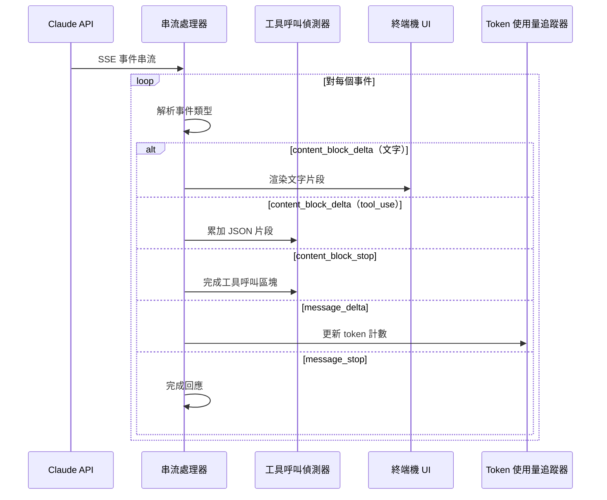
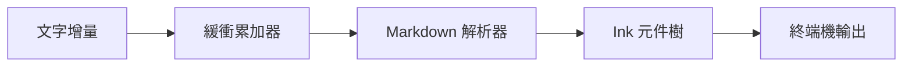
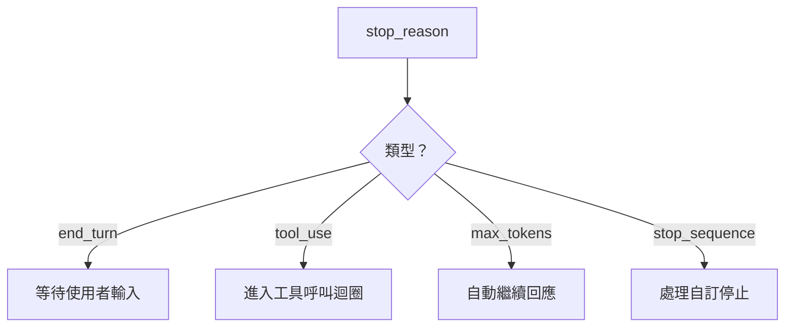

# 串流處理管線

**原始碼**：`src/query.ts` — 串流事件處理器及 `src/services/claude.ts`

## 概述

Claude Code 以即時串流的方式處理 API 回應，而非等待完整回應。這使得即時文字渲染、漸進式工具呼叫偵測，以及響應式取消成為可能——這些對於互動式終端機代理至關重要。

## 串流事件流程



## 事件類型

Claude API 發送 Server-Sent Events（SSE），包含以下關鍵事件類型：

| 事件 | 用途 | 處理動作 |
|------|------|----------|
| `message_start` | 開始新回應 | 初始化回應緩衝區 |
| `content_block_start` | 新的文字或工具區塊 | 建立區塊累加器 |
| `content_block_delta` | 增量內容 | 附加至當前區塊 |
| `content_block_stop` | 區塊完成 | 完成並分派 |
| `message_delta` | 停止原因 + 使用量 | 記錄停止原因 |
| `message_stop` | 回應完成 | 觸發後處理 |

## 文字渲染管線

文字增量在到達終端機之前會經過一個渲染管線：



關鍵行為：
- 文字會短暫緩衝以避免在快速增量時過度重新渲染
- Markdown 以增量方式解析——部分粗體/程式碼區塊能優雅處理
- Ink 渲染引擎會批次更新以減少終端機閃爍

## 工具呼叫偵測

工具呼叫以增量 JSON 片段的形式出現在 `content_block_delta` 事件中：

1. **累加** — JSON 片段被串接至緩衝區
2. **類型偵測** — `content_block_start` 將區塊識別為 `tool_use` 類型
3. **參數解析** — 當 `content_block_stop` 觸發時，完整的 JSON 被解析
4. **驗證** — 參數依據工具的 JSON Schema 進行驗證
5. **分派** — 有效的工具呼叫進入[工具呼叫迴圈](./tool-call-loop)

```typescript
// 簡化的工具呼叫累加
interface ToolCallAccumulator {
  id: string;
  name: string;
  inputJson: string; // 累加的 JSON 片段
}
```

## 停止原因

`message_delta` 事件帶有一個 `stop_reason`，決定接下來的行為：



- `end_turn` — Claude 自然地完成了其回應
- `tool_use` — Claude 想要執行一個或多個工具
- `max_tokens` — 回應達到 token 限制；可能需要繼續
- `stop_sequence` — 觸發了已設定的停止序列

## Token 使用量追蹤

每個回應都包含 token 使用量資料，用於追蹤：

- **成本估算** — 向使用者顯示累計成本
- **上下文視窗管理** — 判斷何時需要壓縮歷史
- **快取命中追蹤** — 監控 prompt caching 的效能

```typescript
interface TokenUsage {
  input_tokens: number;
  output_tokens: number;
  cache_creation_input_tokens: number;
  cache_read_input_tokens: number;
}
```

## 取消操作

使用者可以使用 Ctrl+C 取消串流回應：

1. SSE 連線被中止
2. 部分文字保留在對話歷史中
3. 任何進行中的工具呼叫被捨棄
4. 會話返回輸入模式

## 設計模式

- **觀察者模式（Observer Pattern）** — 串流事件分派至多個處理器（UI、token 追蹤器、工具偵測器）
- **累加器模式（Accumulator Pattern）** — 部分 JSON 片段累加直到完整
- **背壓（Backpressure）** — 文字渲染緩衝增量以防止終端機超載

## 相關頁面

- [概述](./index) — 查詢引擎概述
- [上下文組裝](./context-assembly) — 串流開始前的處理流程
- [工具呼叫迴圈](./tool-call-loop) — 偵測到工具呼叫後的處理流程
