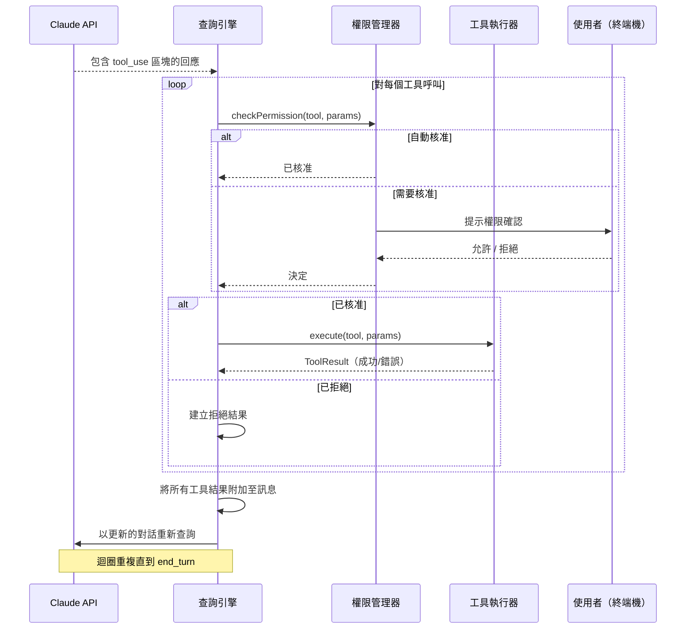
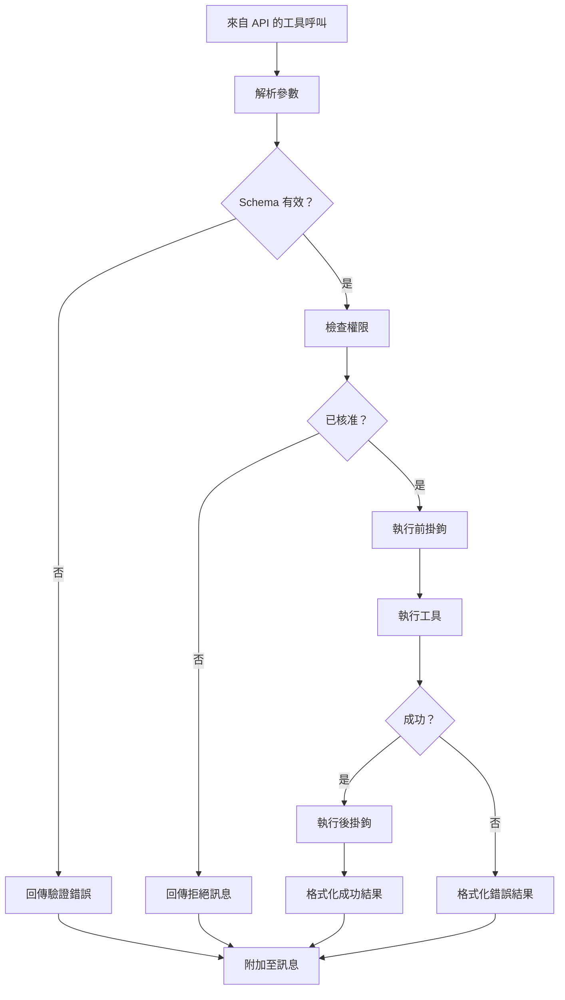

# 工具呼叫迴圈

**原始碼**：`src/query.ts` — 主迴圈及 `src/tools/` — 工具執行

## 概述

工具呼叫迴圈是 Claude Code 代理行為的核心。當 Claude 的回應包含工具呼叫時，此迴圈負責處理權限檢查、執行、結果收集以及重新查詢——不斷重複直到 Claude 產生最終的文字回應。

## 完整迴圈序列



## 工具執行管線

每個工具呼叫都會經過多階段管線：



## 並行模型

Claude Code 使用**單寫/多讀**模型進行工具執行：

- **寫入工具**（Edit、Write、Bash）依序執行——一次只執行一個
- **讀取工具**（Read、Glob、Grep）可以並行執行
- 當一個回應中包含多個工具呼叫時，它們會被批次處理：

```
回應包含：[Read A, Read B, Edit C, Read D]
執行順序：
  1. Read A + Read B（並行）  ← 讀取工具批次處理
  2. Edit C（依序）           ← 寫入工具等待
  3. Read D（依序）           ← 在寫入之後
```

## 工具結果格式

工具結果以 `tool_result` 內容區塊附加至對話中：

```typescript
interface ToolResult {
  type: "tool_result";
  tool_use_id: string;  // 對應工具呼叫 ID
  content: string | ContentBlock[];
  is_error?: boolean;
}
```

關鍵行為：
- 成功結果包含工具的輸出（檔案內容、指令輸出等）
- 錯誤結果包含帶有 `is_error: true` 的錯誤訊息
- 過大的結果會被截斷以防止上下文溢位
- 二進位輸出（圖片）以 base64 內容區塊編碼

## 重新查詢決策

收集所有工具結果後，查詢引擎必須決定是否重新查詢：

| 停止原因 | 動作 |
|----------|------|
| `tool_use` | 始終以工具結果重新查詢 |
| `end_turn` | 停止——已收到最終回應 |
| `max_tokens` | 重新查詢以繼續回應 |

## 迴圈終止

迴圈在以下情況終止：
1. Claude 以 `end_turn` 回應且無工具呼叫
2. 使用者以 Ctrl+C 取消
3. 發生不可復原的錯誤
4. 達到最大迭代次數限制（安全防護）

## 效能最佳化

- **Prompt caching** — 工具結果不會使已快取的系統提示詞失效
- **並行讀取** — 多個唯讀工具同時執行
- **串流重新查詢** — 工具結果就緒後立即開始下一次 API 串流呼叫
- **結果截斷** — 過大的工具輸出會被智慧截斷

## 設計模式

- **命令模式（Command Pattern）** — 每個工具呼叫是一個封裝的命令，具有執行/結果
- **管線模式（Pipeline Pattern）** — 工具呼叫流經 解析 → 驗證 → 授權 → 執行 → 格式化
- **批次處理（Batch Processing）** — 來自同一回應的多個工具呼叫按類型分組以達最佳執行效率

## 相關頁面

- [概述](./index) — 查詢引擎概述
- [串流處理管線](./streaming-pipeline) — 如何在串流中偵測工具呼叫
- [錯誤復原](./error-recovery) — 工具失敗時的處理方式
