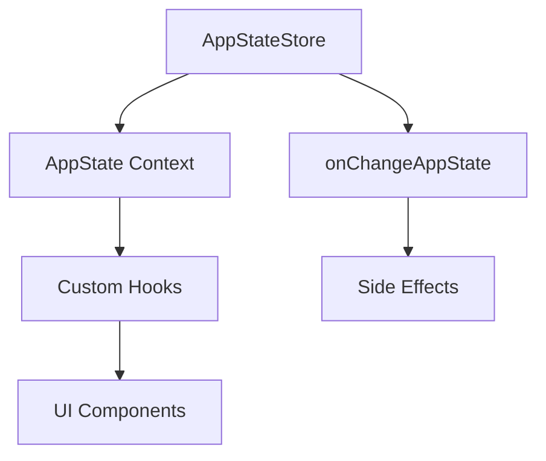

# 狀態管理

**原始碼**: `src/state/AppState.tsx` (23,480 行) 和 `src/state/AppStateStore.ts` (21,847 行)

## 概述

Claude Code 使用基於 React context 和自定義 store 實現的集中式狀態管理模式。`AppState` 是程式碼庫中最大的模組之一。

## 架構



## AppStateStore

中央 store（`src/state/AppStateStore.ts`）管理：

- **訊息** — 完整的對話歷史
- **任務** — 後臺任務狀態和進度
- **代理** — 子代理定義和狀態
- **許可權** — 工具許可權決策
- **通知** — 使用者通知佇列
- **覆蓋層** — 模態框和覆蓋層狀態
- **UI 狀態** — 側邊欄、輸入焦點、滾動位置

## React 整合

`AppState.tsx` 將 store 包裝在 React context provider 中：

```
AppStateProvider
  └── 提供 AppState context
      └── 透過 useAppState() hook 消費
```

元件透過自定義 hooks 訪問狀態，而不是直接讀取 store。這種模式確保狀態變化時 React 正確重新渲染。

## 變化檢測

`src/state/onChangeAppState.ts` 實現了變化檢測系統，在特定狀態屬性變化時觸發副作用。用於：

- 將狀態持久化到磁碟
- 觸發通知
- 更新派生狀態
- 與外部服務同步

## 關鍵狀態切片

| 切片 | 描述 |
|------|------|
| `messages` | 對話歷史（使用者、助手、系統訊息） |
| `tasks` | 後臺任務（bash、代理、遠端會話） |
| `permissions` | 工具許可權快取和待審批項 |
| `agents` | 子代理定義及其狀態 |
| `notifications` | 通知佇列和顯示狀態 |
| `overlays` | 模態對話方塊、選單和覆蓋層 |

## 選擇器

`src/state/selectors.ts` 提供記憶化的選擇器，用於從狀態派生計算值，避免渲染週期中不必要的重複計算。
