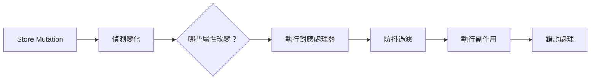
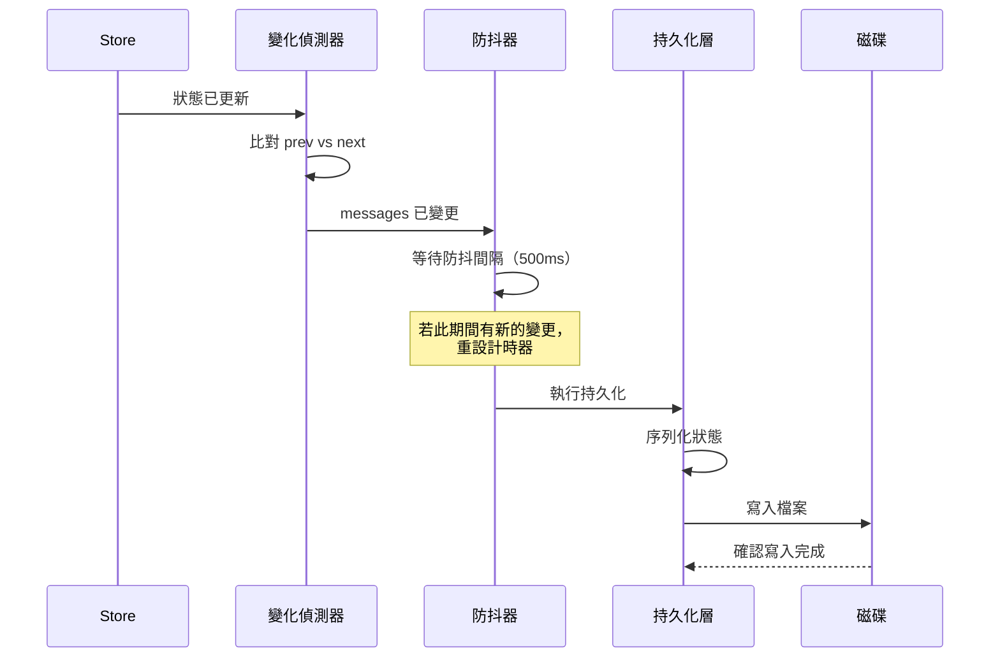

# 變化偵測

**原始碼**：`src/state/onChangeAppState.ts`

## 概述

`onChangeAppState` 實現了一套響應狀態變化的副作用系統。當 `AppStateStore` 中的特定屬性發生變更時，此系統會自動觸發對應的處理器——包括將狀態持久化到磁碟、發送通知、更新衍生狀態，以及與外部服務同步。

## 變化偵測管線



每次 store mutation 之後，系統會比對前後狀態，判斷哪些屬性實際發生了變化，然後僅觸發相關的處理器。

## 處理器註冊

副作用處理器在應用程式啟動時註冊，每個處理器指定它所關注的狀態屬性：

```typescript
// 處理器註冊模式
registerHandler({
  // 監聽的狀態路徑
  watch: ["messages", "tasks"],
  // 變化發生時執行的回呼
  handler: (prevState, nextState) => {
    // 執行副作用邏輯
  },
  // 選項：防抖時間、錯誤處理策略等
  debounce: 500,
});
```

這種宣告式的註冊方式讓系統能夠精確地知道每個處理器的依賴關係。

## Diff 演算法

變化偵測使用淺層比較來判斷狀態是否變更：

1. **頂層屬性比較** — 比較每個狀態切片的參考是否相同
2. **快速路徑** — 若參考相同（`===`），立即跳過該切片
3. **變更集合** — 收集所有已變更的屬性名稱
4. **處理器匹配** — 將變更集合與處理器的 `watch` 清單進行比對

由於 store 在每次 mutation 時會建立新的切片參考，淺層比較足以正確偵測所有變化。

## 副作用分類

| 類別 | 觸發條件 | 行為 | 範例 |
|------|----------|------|------|
| 持久化 | `messages`、`tasks` 變更 | 將狀態寫入磁碟 | 儲存對話歷史 |
| 通知 | `notifications` 變更 | 向使用者顯示通知 | 工具執行完成提示 |
| 衍生狀態 | 任何相依屬性變更 | 重新計算衍生值 | 更新訊息計數統計 |
| 外部同步 | 特定狀態變更 | 與外部服務通訊 | 向分析服務回報事件 |

## 持久化流程



防抖機制確保了在快速連續的狀態更新期間（例如串流回應時），不會對磁碟造成過度寫入。

## 防抖策略

不同類別的副作用使用不同的防抖配置：

- **持久化** — 500ms 防抖，合併高頻寫入
- **通知** — 100ms 防抖，確保快速回饋但避免閃爍
- **衍生狀態** — 0ms（同步），確保衍生值始終最新
- **外部同步** — 1000ms 防抖，降低外部 API 呼叫頻率

防抖使用 trailing edge 策略：在最後一次觸發後等待指定時間才執行。

## 錯誤處理

副作用執行中的錯誤被隔離處理，不會影響其他處理器或 store 的正常運作：

```typescript
// 每個處理器獨立捕獲錯誤
try {
  await handler(prevState, nextState);
} catch (error) {
  // 記錄錯誤但不傳播
  logger.error("Side effect handler failed", {
    handler: handler.name,
    error,
  });
  // 持久化類處理器可配置重試
  if (handler.retryable) {
    scheduleRetry(handler, prevState, nextState);
  }
}
```

關鍵的設計決策：
- 一個處理器的失敗不會阻止其他處理器的執行
- 持久化類的處理器支援重試機制
- 所有錯誤都被記錄以供除錯
- 連續失敗會觸發告警但不會停止系統

## 設計模式

- **觀察者模式（Observer）** — 處理器訂閱狀態變更，在變化發生時被通知
- **發布-訂閱模式（Pub/Sub）** — Store 發布變更事件，處理器按需訂閱特定屬性
- **防抖模式（Debounce）** — 合併高頻事件，減少不必要的副作用執行

## 相關頁面

- [概述](./index) — 狀態管理概述
- [Store 架構](./store-architecture) — 觸發變化偵測的 store mutations
- [選擇器](./selectors) — 從狀態衍生計算值的記憶化選擇器
