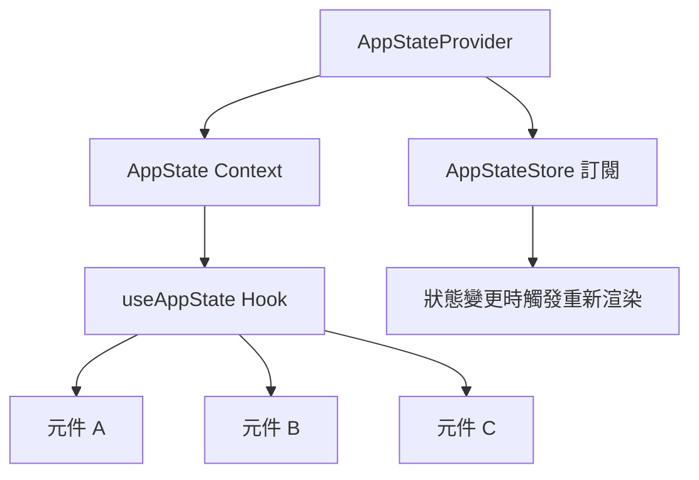
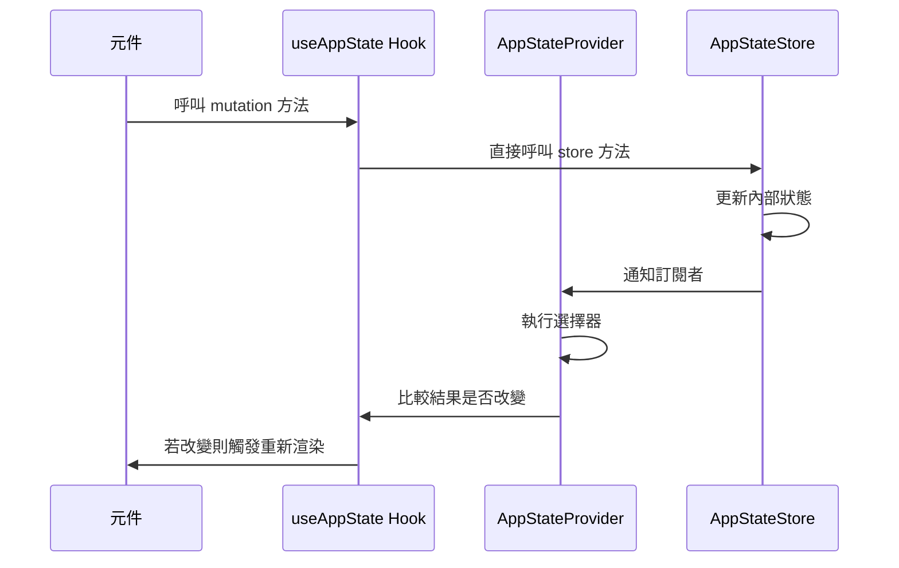

# React 整合

**原始碼**：`src/state/AppState.tsx`（23,480 行）

## 概述

`AppState.tsx` 是連接命令式 `AppStateStore` 與宣告式 React 元件樹的橋樑。它透過 Context Provider 架構將 store 的狀態暴露給元件，並透過自定義 hooks 提供類型安全的存取介面。

## Provider 架構



`AppStateProvider` 在元件樹的頂層包裝整個應用程式，確保所有子元件都能透過 context 存取狀態。

## Context 結構

Context 不直接暴露原始的 store 物件，而是提供一個精心設計的介面：

```typescript
interface AppStateContext {
  // 狀態讀取
  state: AppState;
  // 常用 mutation 方法
  addMessage: (message: Message) => void;
  updateTask: (id: string, update: Partial<Task>) => void;
  setOverlay: (key: string, state: OverlayState) => void;
  // ... 其他方法
}
```

這種封裝允許在不影響消費者的情況下更改底層 store 實現。

## useAppState Hook

元件透過 `useAppState` hook 消費狀態：

```typescript
function MessageList() {
  const { state, addMessage } = useAppState();
  return (
    <div>
      {state.messages.map(msg => (
        <MessageBubble key={msg.id} message={msg} />
      ))}
    </div>
  );
}
```

Hook 提供了：
- 型別安全的狀態存取
- 在 context 外部呼叫時拋出有意義的錯誤訊息
- 對 store mutation 方法的直接參考

## 重新渲染優化

由於全域狀態的更新可能導致不必要的重新渲染，`AppState.tsx` 採用了多種優化策略：

### 選擇性訂閱

元件可以透過選擇器函式僅訂閱所需的狀態片段：

```typescript
// 僅在 messages 變更時重新渲染
const messages = useAppState(state => state.messages);

// 僅在特定任務變更時重新渲染
const task = useAppState(state => state.tasks.get(taskId));
```

### 淺比較

當選擇器返回相同的參考時，跳過重新渲染：

- 原始型別使用 `===` 比較
- 陣列和物件使用淺層屬性比較
- 避免不必要的元件更新週期

### 記憶化

```typescript
// 內部使用 useMemo 快取衍生值
const activeMessages = useAppState(
  state => state.messages.filter(m => !m.deleted),
  // 自定義相等性比較
  shallowEqual
);
```

## 狀態變更傳播



這個流程確保了僅有真正依賴變更資料的元件會重新渲染。

## Hook 組合

複雜的元件可以組合多個 `useAppState` 呼叫，每個呼叫獨立訂閱不同的狀態片段：

```typescript
function PermissionDialog() {
  const messages = useAppState(s => s.messages);
  const permissions = useAppState(s => s.permissions);
  const overlay = useAppState(s => s.overlays.permissions);
  // 每個選擇器獨立追蹤，最小化不必要的重新渲染
}
```

## 效能考量

| 策略 | 目的 | 影響 |
|------|------|------|
| 選擇性訂閱 | 僅監聽所需狀態 | 減少 80% 以上不必要的重新渲染 |
| 淺比較 | 避免參考相等的重複渲染 | 防止無變更的渲染週期 |
| 記憶化 | 快取衍生計算 | 避免每次渲染重新計算 |
| Batch 更新 | 合併同步的多次狀態變更 | 單次渲染週期處理多個更新 |

## 設計模式

- **Provider 模式** — 透過 React context 向元件樹提供狀態，無需逐層傳遞 props
- **Hook 組合模式** — 將狀態存取邏輯封裝為可重用的 hooks
- **衍生狀態模式** — 透過選擇器從原始狀態計算衍生值，避免冗餘儲存

## 相關頁面

- [概述](./index) — 狀態管理概述
- [Store 架構](./store-architecture) — 底層 store 的內部結構
- [選擇器](./selectors) — 記憶化選擇器的詳細說明
