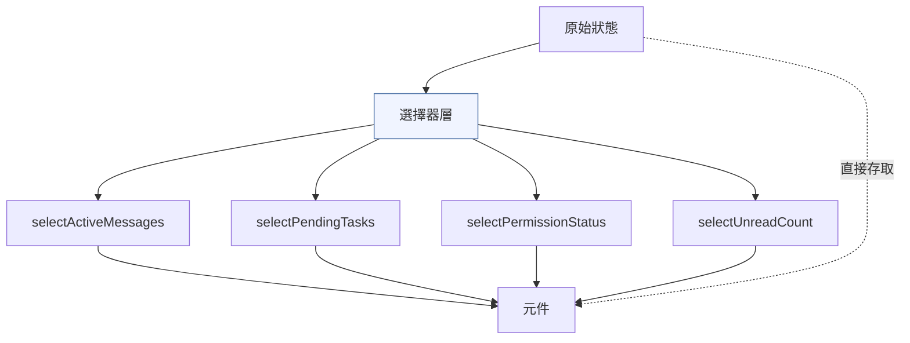
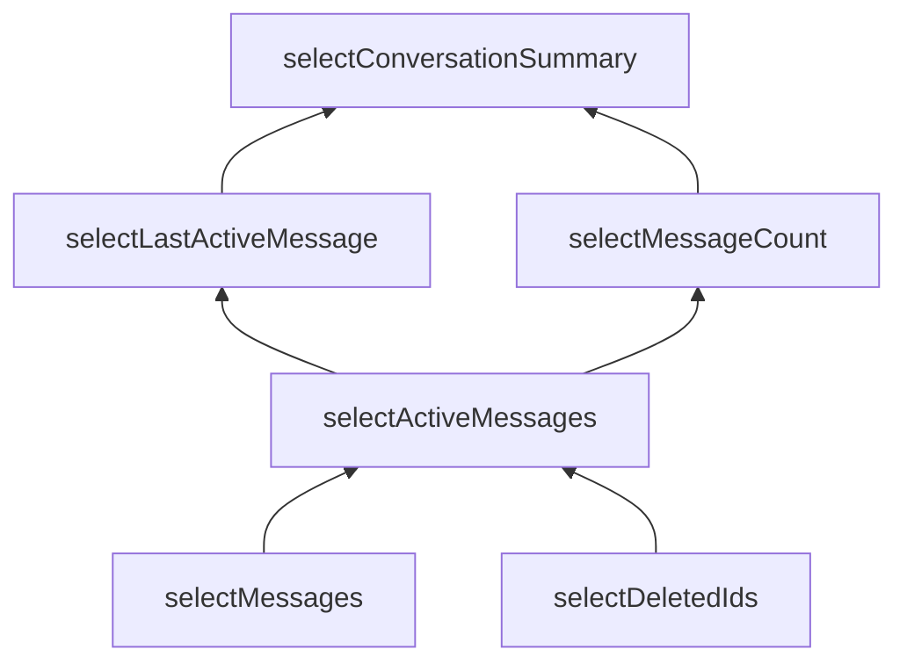

# 選擇器

**原始碼**：`src/state/selectors.ts`

## 概述

選擇器是一組記憶化函式，負責從原始狀態衍生計算值。它們避免了在每次渲染週期中重複執行昂貴的計算，同時提供了一層抽象，將元件與狀態的內部結構解耦。

## 選擇器架構



元件應優先透過選擇器存取衍生資料，而非自行從原始狀態計算。直接存取原始狀態僅適用於簡單的屬性讀取。

## 為何需要選擇器

選擇器解決了三個核心問題：

1. **效能** — 記憶化避免重複計算。如果輸入未改變，直接返回快取結果
2. **抽象** — 元件不需知道狀態的內部結構。狀態形狀變更時只需更新選擇器
3. **一致性** — 衍生邏輯集中在一處，避免多個元件各自實現相同的計算

```typescript
// 不好：每個元件各自計算
const activeMessages = state.messages.filter(m => !m.deleted && !m.hidden);

// 好：使用選擇器（記憶化 + 集中管理）
const activeMessages = selectActiveMessages(state);
```

## 選擇器組合

複雜的選擇器可以由簡單的選擇器組合而成：



組合式選擇器的每一層都獨立記憶化——當底層選擇器的結果未改變時，上層選擇器會直接返回快取值。

## 常用選擇器

| 選擇器 | 輸入 | 輸出 | 用途 |
|--------|------|------|------|
| `selectActiveMessages` | `messages` | `Message[]` | 過濾已刪除/隱藏的訊息 |
| `selectPendingTasks` | `tasks` | `Task[]` | 取得進行中的任務清單 |
| `selectPermissionStatus` | `permissions` | `PermissionMap` | 取得各工具的授權狀態 |
| `selectUnreadCount` | `notifications` | `number` | 計算未讀通知數量 |
| `selectAgentStatus` | `agents` | `AgentStatusMap` | 取得各代理的執行狀態 |
| `selectConversationCost` | `messages` | `CostSummary` | 計算對話的 token 用量與費用 |

## 記憶化策略

選擇器使用輸入參考比較來決定是否需要重新計算：

```typescript
function createSelector<T, R>(
  // 輸入選擇器：從狀態中擷取依賴項
  inputSelector: (state: AppState) => T,
  // 轉換函式：將輸入轉換為輸出
  transform: (input: T) => R
): (state: AppState) => R {
  let lastInput: T;
  let lastResult: R;

  return (state: AppState) => {
    const input = inputSelector(state);
    // 僅在輸入改變時重新計算
    if (input !== lastInput) {
      lastInput = input;
      lastResult = transform(input);
    }
    return lastResult;
  };
}
```

關鍵行為：
- 使用 `===` 參考相等性檢查輸入
- 若輸入參考未改變，直接返回快取的結果
- 若輸入改變，執行轉換函式並更新快取
- 每個選擇器維護自己的獨立快取

## 程式碼範例

在元件中結合 `useAppState` 使用選擇器：

```typescript
function TaskPanel() {
  // 透過選擇器取得衍生狀態
  const pendingTasks = useAppState(selectPendingTasks);
  const taskCount = useAppState(selectTaskCount);

  return (
    <Panel title={`任務 (${taskCount})`}>
      {pendingTasks.map(task => (
        <TaskItem key={task.id} task={task} />
      ))}
    </Panel>
  );
}
```

選擇器與 `useAppState` 的整合確保了元件僅在衍生值實際改變時才重新渲染。

## 效能影響

| 場景 | 無選擇器 | 有選擇器 | 改善 |
|------|----------|----------|------|
| 訊息清單渲染 | 每次渲染過濾整個陣列 | 僅在 messages 變更時過濾 | ~10 倍 |
| 任務計數顯示 | 每次渲染遍歷 Map | 僅在 tasks 變更時計算 | ~5 倍 |
| 費用統計面板 | 每次渲染聚合所有訊息 | 僅在對話更新時計算 | ~20 倍 |

在訊息數量大的長對話中，選擇器的效能優勢更為顯著。

## 設計模式

- **記憶化模式（Memoization）** — 快取函式結果，避免相同輸入的重複計算
- **選擇器模式（Selector Pattern）** — 提供統一的介面從複雜的狀態結構中擷取資料
- **衍生狀態模式（Derived State）** — 從原始狀態計算衍生值，而非冗餘儲存

## 相關頁面

- [概述](./index) — 狀態管理概述
- [React 整合](./react-integration) — 選擇器如何與 useAppState hook 配合
- [變化偵測](./change-detection) — 衍生狀態作為副作用的一種
