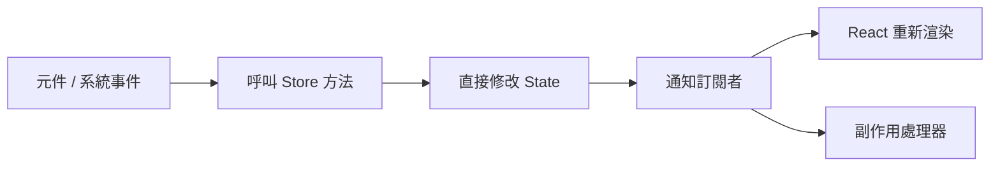
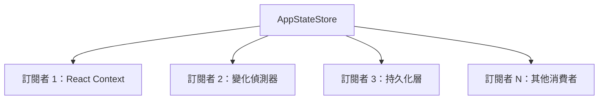

# Store 架構

**原始碼**：`src/state/AppStateStore.ts`（21,847 行）

## 概述

`AppStateStore` 是 Claude Code 整個應用程式狀態的單一事實來源。它是一個命令式的可變 store，負責管理所有狀態切片——從對話訊息到 UI 覆蓋層——並透過訂閱模型通知消費者狀態的變更。

## Mutations 流程



Mutation 透過直接方法呼叫執行——不需要 action 物件或 reducer 函式。當元件或系統事件需要更新狀態時，直接呼叫 store 上的對應方法即可。

## 狀態形狀

Store 內部維護了結構化的狀態物件：

```typescript
interface AppState {
  messages: Message[];
  tasks: Map<string, Task>;
  agents: AgentDefinition[];
  permissions: PermissionCache;
  notifications: Notification[];
  overlays: OverlayState;
  uiState: UIState;
  // ... 其他切片
}
```

每個頂層屬性代表一個邏輯「切片」，封裝一組相關的狀態資料。

## Mutation 模式

Store 採用直接方法呼叫進行 mutations，而非 Redux 風格的 dispatch：

```typescript
// 直接方法呼叫（實際模式）
store.addMessage(newMessage);
store.updateTask(taskId, { status: "completed" });
store.setOverlay("permissions", { visible: true });

// 不使用 dispatch/action 模式
// store.dispatch({ type: "ADD_MESSAGE", payload: newMessage });
```

這種模式提供了更簡單的呼叫堆疊和更直觀的型別安全。

## 切片組織

| 切片 | 用途 | 更新頻率 |
|------|------|----------|
| `messages` | 對話歷史（使用者、助手、系統訊息） | 高 — 每次回合 |
| `tasks` | 後臺任務狀態與進度 | 中 — 工具執行時 |
| `agents` | 子代理定義及執行狀態 | 低 — 代理建立/完成時 |
| `permissions` | 工具權限快取與待審批項 | 低 — 使用者授權時 |
| `notifications` | 通知佇列與顯示狀態 | 中 — 事件觸發時 |
| `overlays` | 模態對話方塊、選單、覆蓋層 | 中 — 使用者互動時 |
| `uiState` | 側邊欄、輸入焦點、捲動位置 | 高 — 使用者互動時 |

## 訂閱模型

Store 實現了觀察者模式，允許消費者訂閱狀態變更：



- 每當 mutation 方法被呼叫，store 會觸發所有已註冊的訂閱回呼
- 訂閱者接收最新狀態的參考，而非狀態副本
- 取消訂閱透過返回的清理函式處理

## 初始化流程

Store 在應用程式啟動時經歷多步驟初始化：

1. **建立實例** — 以預設值建構 store 單例
2. **載入持久化狀態** — 從磁碟還原先前會話的狀態
3. **合併設定** — 套用使用者設定與功能旗標
4. **註冊訂閱者** — 連接 React context、變化偵測器、持久化層
5. **標記就緒** — 通知元件 store 已準備好供使用

在初始化完成之前，元件會收到初始預設狀態。

## 設計模式

- **單例模式（Singleton）** — 整個應用程式僅有一個 store 實例，確保狀態的一致性
- **觀察者模式（Observer）** — 訂閱者在狀態變更時收到通知，實現鬆耦合
- **中介者模式（Mediator）** — Store 作為元件之間的中介，避免直接元件間通訊

## 相關頁面

- [概述](./index) — 狀態管理概述
- [React 整合](./react-integration) — Store 如何透過 React context 暴露給元件
- [變化偵測](./change-detection) — 狀態變更後的副作用處理
