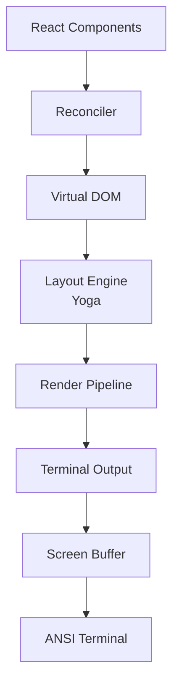

# 終端 UI

**原始碼**: `src/ink/`（50+ 檔案）

Claude Code 使用基於 Ink（React for CLIs）的自定義終端 UI 引擎。`src/ink/` 目錄包含用於構建豐富終端介面的完整渲染系統。

## 架構

## 核心元件

### 渲染器 (`ink/renderer.ts`)
主渲染協調器，管理 React reconciler 並觸釋出局/繪製週期。

### Reconciler (`ink/reconciler.ts`)
自定義 React reconciler，將 React 元素對映到終端 DOM 節點。

### DOM (`ink/dom.ts`)
終端元素的虛擬 DOM 實現。每個節點代表一個終端 UI 元素，具有文字內容、樣式和佈局約束等屬性。

### 佈局引擎 (`ink/layout/`)
- `engine.ts` — 佈局計算協調器
- `yoga.ts` — 整合 Yoga（Facebook 的 flexbox 佈局引擎）
- `geometry.ts` — 位置和尺寸計算
- `node.ts` — 佈局節點抽象

### 渲染管線 (`ink/render-node-to-output.ts`、`ink/render-to-screen.ts`)
將佈局後的 DOM 樹轉換為 ANSI 轉義文字用於終端顯示。

### 文字處理
- `wrap-text.ts` — 按終端寬度進行換行
- `measure-text.ts` — 文字尺寸測量
- `stringWidth.ts` — Unicode 感知的字元寬度計算
- `widest-line.ts` — 多行寬度計算

## 終端 I/O (`ink/termio/`)

低層終端通訊：

- **ANSI 解析** — 解析輸入中的 ANSI 轉義序列
- **CSI** — 控制序列引導器處理
- **OSC** — 作業系統命令序列
- **SGR** — 選擇圖形再現（顏色、樣式）
- **分詞** — 輸入流分詞

## 功能特性

- **搜尋高亮** (`searchHighlight.ts`) — 帶高亮的文字搜尋
- **選擇** (`selection.ts`) — 文字選擇支援
- **命中測試** (`hit-test.ts`) — 點選/游標位置對映
- **按鍵解析** (`parse-keypress.ts`) — 原始輸入到按鍵事件的轉換
