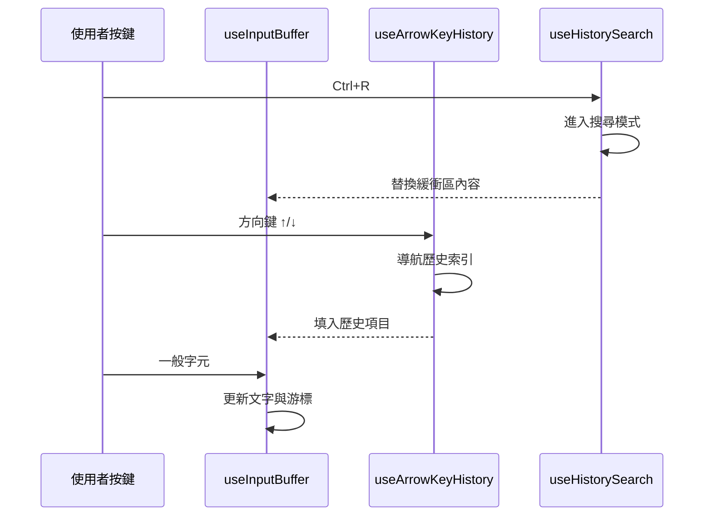
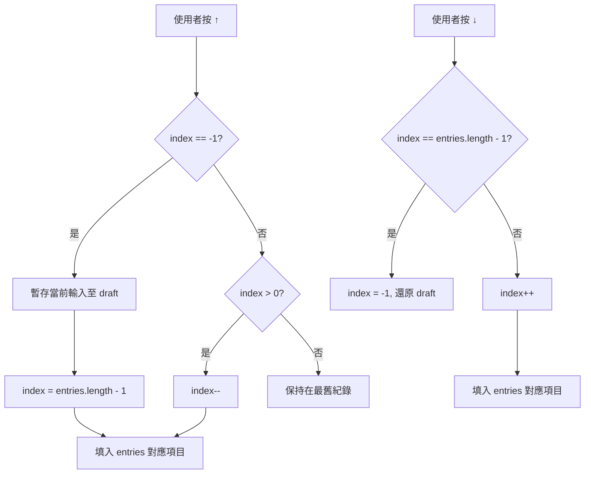
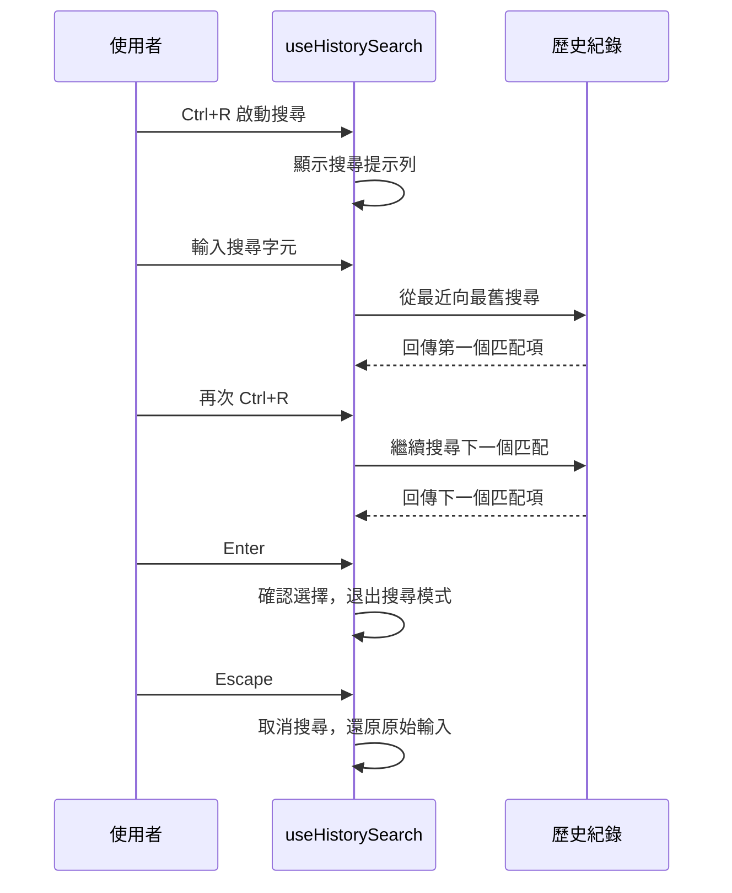

# 輸入 Hooks

**原始碼**: `src/hooks/useInputBuffer.ts`, `useArrowKeyHistory.ts`, `useHistorySearch.ts`

三個核心輸入 hooks 協同運作，提供終端級別的文字輸入體驗：緩衝區管理、歷史導航和反向搜尋。

## 按鍵處理管線



## useInputBuffer

管理文字輸入緩衝區，處理字元插入、刪除和游標位置。

### 狀態結構

```typescript
interface InputBufferState {
  text: string;          // 目前緩衝區文字
  cursorPos: number;     // 游標位置（0-indexed）
  selection: Range | null; // 選取範圍
}
```

### 操作表

| 操作 | 按鍵 | 行為 |
|------|------|------|
| 插入字元 | 一般字元 | 在游標位置插入，游標右移 |
| 刪除前方 | Backspace | 刪除游標前一個字元 |
| 刪除後方 | Delete | 刪除游標後一個字元 |
| 游標左移 | ← | 游標位置 -1 |
| 游標右移 | → | 游標位置 +1 |
| 行首 | Home / Ctrl+A | 游標移至位置 0 |
| 行尾 | End / Ctrl+E | 游標移至文字末端 |
| 清除行 | Ctrl+U | 清空緩衝區 |
| 刪除至行尾 | Ctrl+K | 刪除游標後所有字元 |

### 核心邏輯

```typescript
function useInputBuffer() {
  const [state, dispatch] = useReducer(inputReducer, initialState);

  const handleKey = useCallback((key: KeyInput) => {
    if (key.ctrl && key.name === "u") {
      dispatch({ type: "CLEAR_LINE" });
    } else if (key.name === "backspace") {
      dispatch({ type: "DELETE_BACK" });
    } else if (key.char) {
      dispatch({ type: "INSERT", char: key.char });
    }
  }, []);

  return { ...state, handleKey, setText: (t: string) => dispatch({ type: "SET", text: t }) };
}
```

## useArrowKeyHistory

方向鍵歷史導航，允許使用者用 ↑/↓ 鍵瀏覽之前輸入的命令。

### 狀態

```typescript
interface HistoryState {
  entries: string[];    // 歷史紀錄陣列
  index: number;        // 目前導航位置（-1 表示當前輸入）
  draft: string;        // 暫存的當前輸入
}
```

### 導航流程



按下 ↑ 時，若目前在最新位置（`index === -1`），先暫存使用者正在編輯的文字到 `draft`，再進入歷史。按 ↓ 回到最新位置時，自動還原 `draft` 內容。

## useHistorySearch

實現 Ctrl+R 反向搜尋功能，類似 bash/zsh 的行為。

### 搜尋流程



### 搜尋狀態

```typescript
interface SearchState {
  active: boolean;       // 是否在搜尋模式中
  query: string;         // 搜尋關鍵字
  matchIndex: number;    // 目前匹配位置
  matches: number[];     // 所有匹配的歷史索引
}
```

搜尋採用子字串匹配策略，從歷史紀錄末端（最新）開始向前搜尋。每次輸入字元時重新掃描，每次按 Ctrl+R 跳到下一個匹配。

## Hook 組合

三個 hooks 形成三層組合結構：

```
┌─────────────────────────────────┐
│        useHistorySearch         │  ← 最高優先：Ctrl+R 搜尋模式
├─────────────────────────────────┤
│       useArrowKeyHistory        │  ← 中間層：方向鍵導航
├─────────────────────────────────┤
│         useInputBuffer          │  ← 基礎層：文字緩衝區管理
└─────────────────────────────────┘
```

按鍵事件由上至下傳遞。當 `useHistorySearch` 處於啟用狀態時，它會攔截大部分按鍵。否則，方向鍵事件由 `useArrowKeyHistory` 處理，其餘字元輸入交給 `useInputBuffer`。

## 設計模式

- **狀態機模式（State Machine）**：`useHistorySearch` 在「正常模式」和「搜尋模式」之間切換，每個模式有不同的按鍵處理邏輯。
- **備忘錄模式（Memento）**：`useArrowKeyHistory` 的 `draft` 欄位保存並還原使用者的編輯狀態，確保歷史導航後可無損回到原始輸入。
- **組合模式（Composition）**：三個 hooks 各自獨立、職責單一，透過資料流組合成完整的輸入系統，而非繼承或耦合。

---

輸入 Hooks 共同構成一個類 shell 的終端輸入體驗。每個 hook 封裝一個明確的功能面向，使得測試和維護各自獨立。
