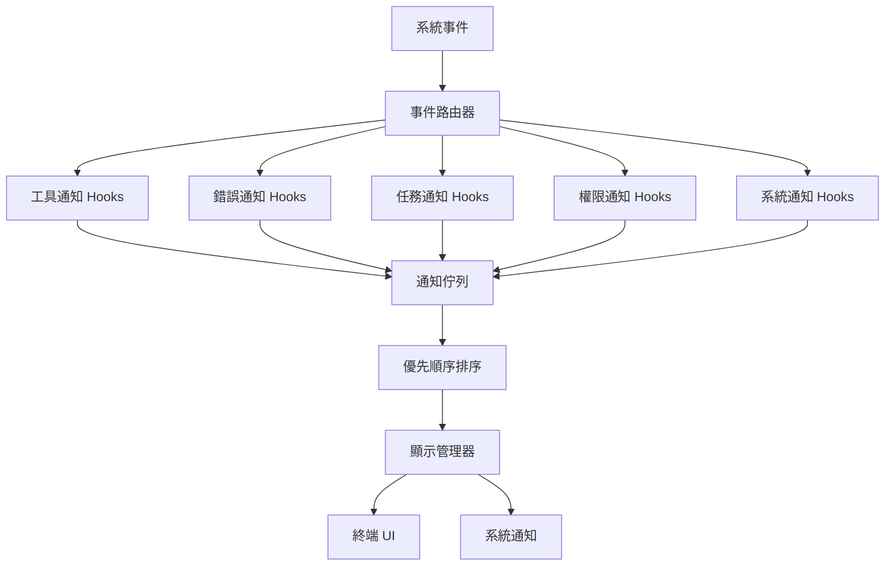
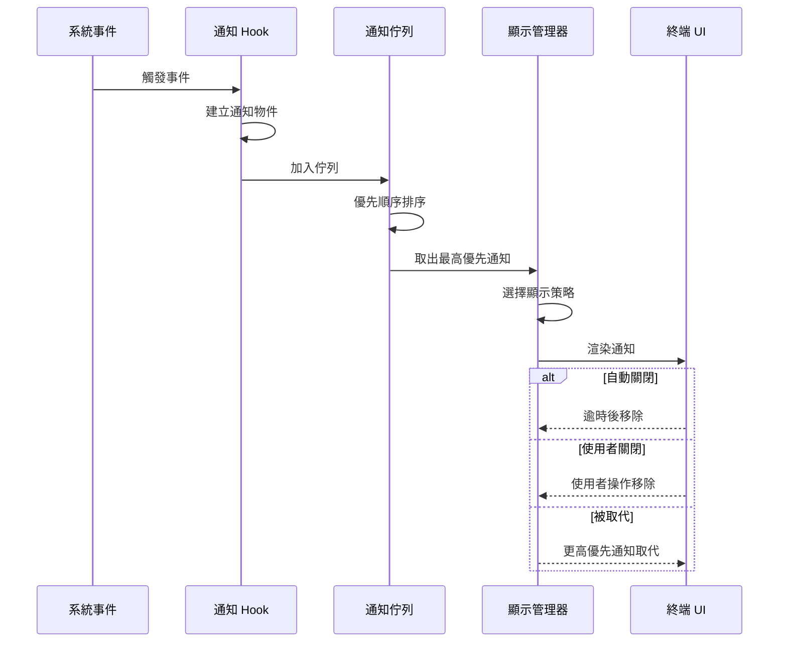

# 通知 Hooks

**原始碼**: `src/hooks/notifs/`

Claude Code 使用 18 個專用通知 hooks 管理不同類型的使用者通知。每個 hook 負責特定事件類別的通知生成、顯示策略和生命週期管理。

## 通知系統架構



## 通知 Hook 分類

| 類別 | Hook 數量 | 代表 Hook | 用途 |
|------|-----------|----------|------|
| 工具通知 | 5 | `useToolStartNotif`, `useToolEndNotif` | 工具執行開始/結束/進度 |
| 錯誤通知 | 3 | `useErrorNotif`, `useApiErrorNotif` | 執行錯誤、API 錯誤、逾時 |
| 任務通知 | 4 | `useTaskCompleteNotif`, `useBackgroundTaskNotif` | 任務完成、背景任務狀態 |
| 權限通知 | 3 | `usePermissionRequestNotif`, `usePermissionGrantNotif` | 權限請求、批准、拒絕 |
| 系統通知 | 3 | `useSessionNotif`, `useUpdateNotif` | 會話狀態、版本更新、連線 |

## 通知生命週期



## 通知物件結構

```typescript
interface Notification {
  id: string;                    // 唯一識別碼
  type: NotificationType;        // 通知類型
  priority: Priority;            // 優先順序等級
  title: string;                 // 標題
  body: string;                  // 內容
  timestamp: number;             // 建立時間戳
  duration: number | "persistent"; // 顯示時長（毫秒）或持續顯示
  dismissible: boolean;          // 是否可手動關閉
  actions?: NotificationAction[];// 可選的操作按鈕
}

type NotificationType =
  | "tool_start" | "tool_end" | "tool_error"
  | "permission_request" | "permission_result"
  | "task_complete" | "background_task"
  | "api_error" | "session" | "system";

type Priority = "critical" | "high" | "normal" | "low";
```

## 顯示策略

每種通知類型有不同的顯示行為：

| 策略 | 適用類型 | 行為 |
|------|---------|------|
| 內嵌（Inline） | 工具通知、任務通知 | 在訊息流中顯示 |
| 橫幅（Banner） | 錯誤通知、系統通知 | 畫面頂部/底部橫幅 |
| 持續（Persistent） | 權限請求 | 保持顯示直到使用者回應 |
| 靜默（Silent） | 背景任務 | 僅記錄日誌，不顯示 UI |
| 系統通知（OS） | 任務完成（視窗未聚焦時） | 透過作業系統通知中心 |

## 優先順序和佇列

通知佇列採用優先順序排序，同優先順序按時間先後排列：

```typescript
const priorityOrder: Record<Priority, number> = {
  critical: 0,  // 權限請求、嚴重錯誤
  high: 1,      // API 錯誤、工具失敗
  normal: 2,    // 工具完成、任務進度
  low: 3,       // 背景任務更新、系統資訊
};
```

佇列規則：
- **critical** 通知立即顯示，中斷目前通知
- **high** 通知排在佇列最前面，等待目前通知結束
- **normal** 和 **low** 按先進先出順序排列
- 佇列上限 50 條，溢出時丟棄最舊的 **low** 通知

## Hook 實現模式

每個通知 hook 遵循統一的實現模式：

```typescript
function useToolEndNotif() {
  const { enqueue } = useNotificationQueue();
  const settings = useNotificationSettings();

  useEffect(() => {
    const unsubscribe = toolEvents.on("tool:end", (event) => {
      if (!settings.toolNotifications) return; // 檢查設定

      enqueue({
        type: "tool_end",
        priority: event.error ? "high" : "normal",
        title: `${event.toolName} 完成`,
        body: event.error ? `錯誤：${event.error.message}` : event.summary,
        duration: event.error ? 5000 : 3000,
        dismissible: true,
      });
    });

    return unsubscribe;
  }, [settings]);
}
```

## 自訂設定

使用者可透過設定調整通知行為：

```json
{
  "notifications": {
    "toolNotifications": true,
    "errorNotifications": true,
    "taskNotifications": true,
    "systemNotifications": false,
    "osNotifications": true,
    "quietMode": false
  }
}
```

`quietMode` 啟用時，僅 **critical** 優先順序的通知會顯示，其餘全部靜默處理。

## 設計模式

- **觀察者模式（Observer）**：每個 hook 訂閱特定事件類型，事件觸發時建立對應通知。事件來源與通知 hook 完全解耦。
- **佇列模式（Queue）**：通知佇列管理顯示順序和併發控制，避免多個通知同時爭搶 UI 空間。優先順序佇列確保重要通知優先呈現。
- **模板方法模式（Template Method）**：18 個 hooks 共享統一的生命週期（訂閱 → 建立 → 加入佇列），各自僅定義事件型別和通知內容的差異。

---

通知 Hooks 將 18 種不同事件的通知邏輯拆分為獨立 hooks，每個 hook 職責單一。通知佇列和顯示管理器作為集中協調器，確保通知按優先順序有序呈現，不會造成 UI 混亂。
