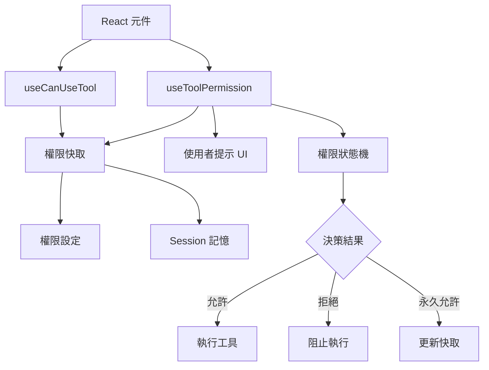
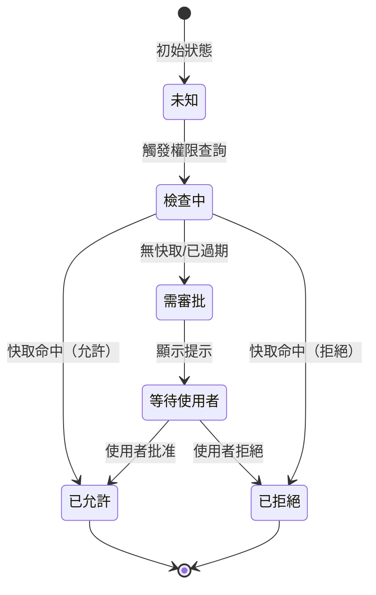

# 權限 Hooks

**原始碼**: `src/hooks/toolPermission/`

權限 Hooks 負責工具呼叫的權限生命週期管理，包含同步檢查、非同步審批流程、快取策略和使用者提示整合。

## 權限 Hook 架構



## useCanUseTool

同步權限檢查 hook，用於 UI 渲染時快速判斷工具是否可用。不觸發任何使用者互動。

### 回傳值

```typescript
interface CanUseToolResult {
  canUse: boolean;           // 工具是否可用
  reason: string | null;     // 不可用時的原因
  requiresApproval: boolean; // 是否需要使用者審批
  permissionLevel: PermissionLevel; // 目前權限等級
}

type PermissionLevel = "always" | "session" | "once" | "denied" | "unknown";
```

### 權限狀態機



| 狀態 | 說明 | `canUse` |
|------|------|----------|
| 未知 | 尚未檢查 | `false` |
| 檢查中 | 正在查詢快取/設定 | `false` |
| 已允許 | 權限通過 | `true` |
| 需審批 | 需使用者確認 | `false` |
| 等待使用者 | 提示已顯示，等待回應 | `false` |
| 已拒絕 | 權限被拒絕 | `false` |

## useToolPermission

完整權限檢查流程 hook，處理從權限查詢到使用者提示的整個生命週期。

### 檢查流程

```typescript
function useToolPermission(toolName: string, params: ToolParams) {
  // 1. 查詢永久設定（settings.json 中的 allow/deny 規則）
  // 2. 查詢 session 快取（本次會話中的使用者決策）
  // 3. 若無快取命中，進入使用者提示流程
  // 4. 使用者決策後更新快取
  // 5. 回傳最終權限結果
}
```

### 狀態形狀

```typescript
interface ToolPermissionState {
  status: "idle" | "checking" | "prompting" | "resolved";
  result: "allowed" | "denied" | null;
  scope: "always" | "session" | "once" | null;
  toolName: string;
  params: ToolParams;
  promptMessage: string | null;
}
```

### 使用者提示整合

當權限檢查需要使用者決策時，hook 會：

1. 設定 `status = "prompting"` 並生成提示訊息
2. 透過 Ink UI 渲染權限提示元件
3. 提供選項：「本次允許」、「本會話允許」、「永久允許」、「拒絕」
4. 接收使用者選擇後更新狀態和快取

```typescript
// 提示選項對應的快取策略
const scopeMap = {
  "本次允許": "once",      // 不寫入快取
  "本會話允許": "session", // 寫入 session 記憶
  "永久允許": "always",    // 寫入 settings.json
  "拒絕": "denied",        // 記錄拒絕
};
```

## 快取失效

權限快取採用多層策略：

| 層級 | 儲存位置 | 生命週期 | 失效條件 |
|------|---------|---------|---------|
| 永久 | `settings.json` | 跨會話 | 使用者手動修改設定 |
| Session | 記憶體 | 當前會話 | 程序結束 |
| 單次 | 無儲存 | 單次呼叫 | 呼叫完成後立即失效 |

快取查詢順序：永久設定 → session 記憶 → 觸發使用者提示。查詢到第一個匹配即停止，不繼續向下查詢。

### 快取鍵結構

```typescript
// 快取鍵包含工具名稱和參數的雜湊
type CacheKey = `${toolName}:${paramsHash}`;

// 例如：
// "Bash:a1b2c3" → 特定命令的權限
// "Bash:*"      → 該工具所有呼叫的權限（萬用字元規則）
```

## Hook 依賴鏈

```
useToolPermission
├── useCanUseTool（同步檢查）
├── usePermissionCache（快取讀寫）
├── usePermissionPrompt（使用者提示 UI）
└── usePermissionConfig（設定檔讀取）
    └── settings.json
```

`useToolPermission` 作為外觀（facade），整合底層四個專用 hooks。元件通常只需呼叫 `useToolPermission`，除非僅需同步的可用性檢查（此時直接使用 `useCanUseTool`）。

## 設計模式

- **旁路快取模式（Cache-Aside）**：先查快取，未命中時執行完整檢查流程，再將結果寫回快取。快取層與業務邏輯分離。
- **狀態機模式（State Machine）**：權限狀態嚴格按 `idle → checking → prompting → resolved` 轉換，不允許跳躍或倒退。
- **觀察者模式（Observer）**：權限結果變化時，所有訂閱該工具權限的元件同步更新，確保 UI 一致性。

---

權限 Hooks 將複雜的權限決策邏輯封裝為聲明式的 React 介面。元件只需聲明所需工具和參數，hook 負責處理快取查詢、使用者互動和結果傳播的完整流程。
