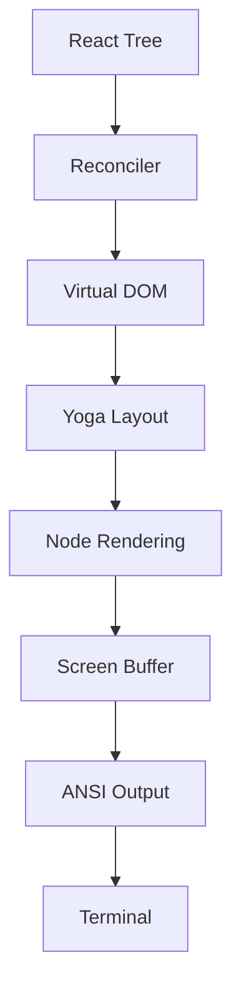

# Ink 渲染引擎

**原始碼**: `src/ink/`（50+ 檔案）

## 概述

Claude Code 使用基於 Ink 的自定義渲染引擎作為終端 UI。這不是標準的 Ink 庫 — 而是為 Claude Code 需求量身定製的全面重新實現。

## 渲染管線

## 核心模組

### Reconciler (`reconciler.ts`)
自定義 React reconciler，將 React 元素轉換為終端 DOM 節點。

### 虛擬 DOM (`dom.ts`)
輕量級終端元素 DOM 實現，支援文字節點、盒子/框架元素和樣式屬性。

### 佈局 (`layout/`)
- **engine.ts** — 佈局計算協調器
- **yoga.ts** — Yoga flexbox 整合
- **geometry.ts** — 位置和尺寸計算
- **node.ts** — 佈局樹節點抽象

### 渲染
- **render-node-to-output.ts** — 將 DOM 節點轉換為輸出單元
- **render-to-screen.ts** — 組裝單元到螢幕緩衝區
- **output.ts** — 最終輸出組裝

## 文字處理

| 模組 | 用途 |
|------|------|
| `wrap-text.ts` | 按終端寬度換行 |
| `measure-text.ts` | 文字尺寸測量 |
| `stringWidth.ts` | Unicode 感知的字元寬度 |
| `widest-line.ts` | 多行寬度計算 |

## 終端 I/O (`termio/`)

低層終端輸入/輸出：ANSI 解析、CSI、OSC、SGR（顏色/樣式）、分詞器。
