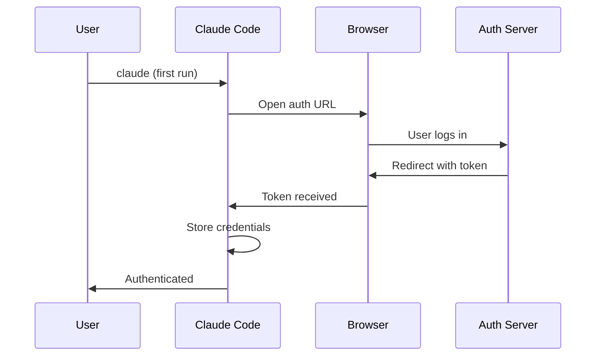

# OAuth 認證

**原始碼**: `src/services/oauth/`

## 概述

OAuth 服務處理 Claude Pro、Team 或 Enterprise 訂閱使用者的基於瀏覽器的認證流程。

## 流程

## 認證方式

| 方式 | 使用場景 |
|------|---------|
| API Key | 透過 `ANTHROPIC_API_KEY` 直接 API 訪問 |
| OAuth | Claude Pro/Team/Enterprise 使用者 |
| Bedrock | AWS Bedrock 憑證 |
| Vertex | Google Cloud 憑證 |

## 命令

- `/login` — 發起認證流程
- `/logout` — 清除儲存的憑證
