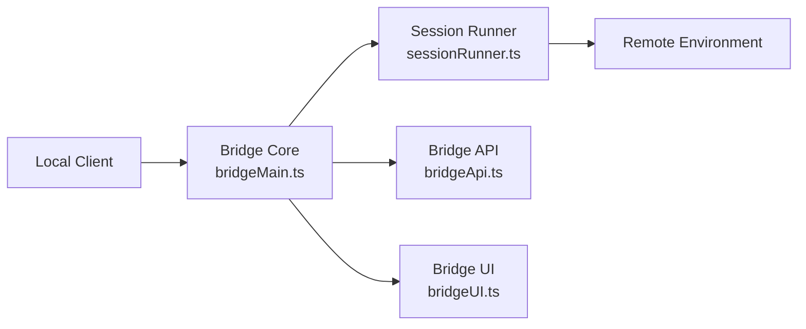

# 遠端橋接

**原始碼**: `src/bridge/`（32 個檔案）

## 概述

橋接系統支援遠端會話管理，允許 Claude Code 將會話轉發到雲執行環境。此功能透過 `BRIDGE_MODE` 特性標誌門控。

## 架構

## 關鍵檔案

| 檔案 | 用途 |
|------|------|
| `bridgeMain.ts` | 主橋接協調器 |
| `bridgeApi.ts` | 橋接通訊 API |
| `createSession.ts` | 會話建立 |
| `sessionRunner.ts` | 會話執行管理 |
| `RemoteSessionManager.ts` | 遠端會話生命週期 |

## 安全性

橋接實現了多層安全：

- **JWT 令牌**（`jwtUtils.ts`）— 會話認證
- **可信裝置**（`trustedDevice.ts`）— 裝置驗證
- **工作金鑰**（`workSecret.ts`）— 加密會話資料
- **HTTPS 傳輸** — 加密通訊
