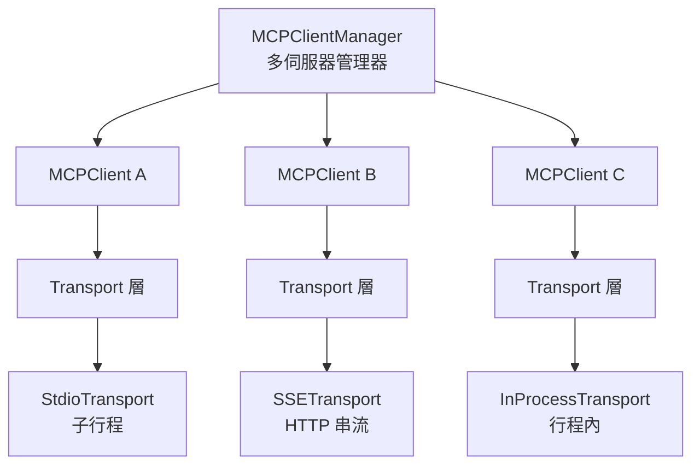
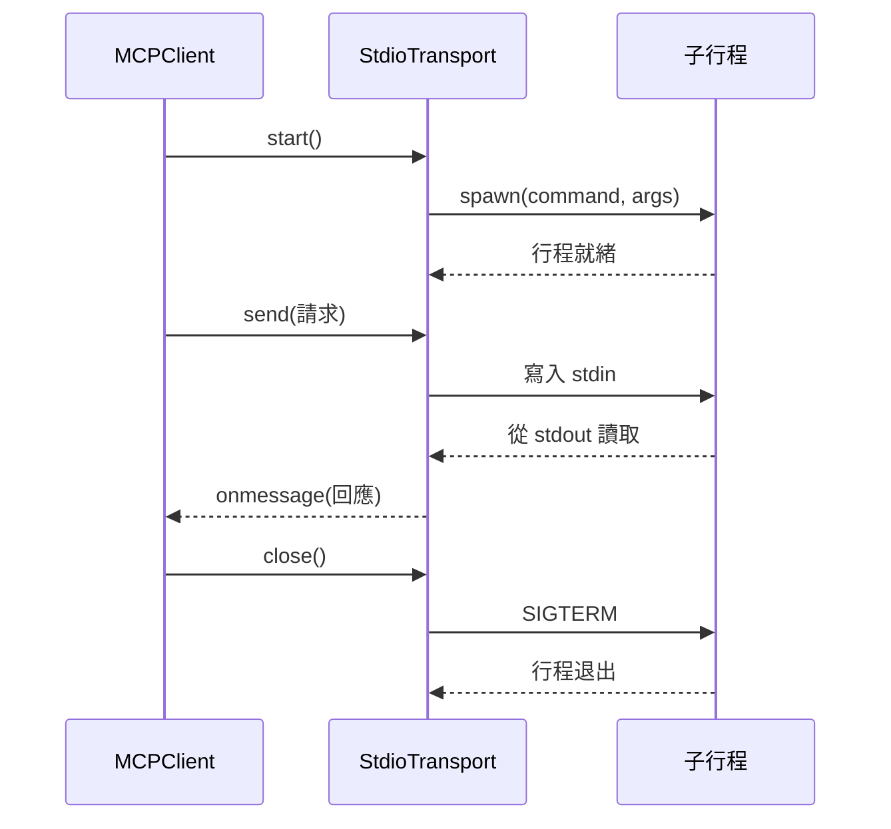

# 客戶端架構

**原始碼**: `src/services/mcp/client.ts`

## 概述

MCP 客戶端負責管理與多個 MCP 伺服器的同時連線。每個伺服器連線封裝在獨立的 `MCPClient` 實例中，透過統一的 Transport 抽象進行通訊。

## 客戶端架構圖



`MCPClientManager` 是最頂層的協調器，為每個已設定的伺服器建立並管理獨立的 `MCPClient` 實例。每個客戶端持有自己的 Transport、工具清單和連線狀態。

## Transport 抽象

所有 Transport 實現統一的介面，隱藏底層通訊協議的差異：

```typescript
interface Transport {
  start(): Promise<void>;
  send(message: JSONRPCMessage): Promise<void>;
  close(): Promise<void>;
  onmessage?: (message: JSONRPCMessage) => void;
  onerror?: (error: Error) => void;
  onclose?: () => void;
}
```

## Transport 型別

| 型別 | 使用場景 | 通訊方式 |
|------|----------|----------|
| **Stdio** | 本地 CLI 工具 | 子行程 stdin/stdout |
| **SSE** | 遠端伺服器 | HTTP Server-Sent Events |
| **Streamable HTTP** | 現代遠端伺服器 | HTTP 雙向串流 |
| **InProcess** | 內建伺服器 | 直接函式呼叫 |

## Stdio Transport 序列圖



Stdio 是最常見的 Transport 型別。客戶端啟動一個子行程，透過 stdin 傳送 JSON-RPC 訊息，從 stdout 接收回應。環境變數和命令列引數在行程啟動時注入。

## SSE Transport

SSE Transport 適用於遠端 MCP 伺服器。客戶端透過 HTTP GET 建立 Server-Sent Events 串流接收伺服器推播的訊息，同時透過 HTTP POST 傳送請求。Streamable HTTP Transport 是其進階版本，支援完整的雙向 HTTP 串流。

## 連線多工

`MCPClientManager` 支援同時管理多個伺服器連線：

- **獨立生命週期** — 每個伺服器獨立啟動、停止、重連
- **工具聚合** — 從所有已連線伺服器收集工具，統一註冊到 Claude Code
- **命名隔離** — 透過 `mcp__serverName__toolName` 格式避免工具名稱衝突
- **並行初始化** — 多個伺服器可同時啟動，減少等待時間

```typescript
// MCPClientManager 聚合所有伺服器工具
const allTools = [];
for (const client of this.clients.values()) {
  const serverTools = await client.listTools();
  allTools.push(...serverTools.map(tool => ({
    name: `mcp__${client.serverName}__${tool.name}`,
    ...tool
  })));
}
```

## 錯誤處理

客戶端實現多層錯誤處理策略：

| 錯誤類型 | 處理方式 |
|----------|----------|
| Transport 錯誤 | 觸發 `onerror` 回呼，嘗試重連 |
| 行程崩潰 | 偵測 exit 事件，啟動重啟流程 |
| 逾時 | 請求設定超時計時器，逾時後拒絕 Promise |
| 協議錯誤 | 記錄錯誤日誌，標記伺服器為不健康 |

所有錯誤都透過結構化日誌記錄，包含伺服器名稱和錯誤上下文，便於問題排查。

## 設計模式

| 模式 | 應用 |
|------|------|
| **適配器模式** | Transport 介面統一不同通訊協議 |
| **工廠模式** | 根據伺服器設定建立對應的 Transport 實例 |
| **連線池** | MCPClientManager 管理多個客戶端實例 |
| **觀察者模式** | Transport 事件（onmessage/onerror/onclose）通知 |

## 相關頁面

- [伺服器生命週期](./server-lifecycle) — 連線建立到關閉的完整流程
- [工具註冊](./tool-registration) — 伺服器工具如何整合到 Claude Code
