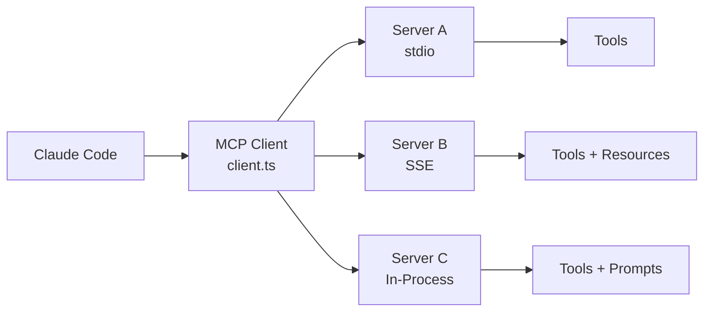

# MCP 整合

**原始碼**: `src/services/mcp/`（24 個檔案）

## 概述

Model Context Protocol (MCP) 是 AI 工具互操作的開放標準。Claude Code 實現了完整的 MCP 客戶端，連線到外部 MCP 伺服器以擴充套件其工具能力。

## 架構



## 關鍵檔案

| 檔案 | 用途 |
|------|------|
| `client.ts` | 核心 MCP 客戶端實現 |
| `config.ts` | 伺服器配置載入 |
| `auth.ts` | 認證處理 |
| `channelPermissions.ts` | MCP 工具的許可權管理 |
| `elicitationHandler.ts` | MCP 伺服器的互動式提示 |

## 伺服器配置

MCP 伺服器在設定中定義：

```json
{
  "mcpServers": {
    "server-name": {
      "command": "npx",
      "args": ["-y", "@org/mcp-server"],
      "env": { "API_KEY": "..." }
    }
  }
}
```

## 能力

MCP 伺服器可以提供：

- **Tools** — 帶 JSON Schema 引數的可執行函式
- **Resources** — 可讀資料來源（檔案、API、資料庫）
- **Prompts** — 常見任務的預定義提示模板

## 連線生命週期

1. **發現** — 從設定載入伺服器配置
2. **啟動** — 啟動伺服器程序（或連線到執行中的伺服器）
3. **握手** — 透過 MCP 協議交換能力
4. **註冊** — 將伺服器工具註冊為可用的 Claude Code 工具
5. **執行** — 將工具呼叫轉發到伺服器，返回結果
6. **清理** — 退出時優雅關閉伺服器

## 深入閱讀

- [客戶端架構](./client-architecture) — MCP 客戶端內部、傳輸抽象（stdio、SSE、行程內）
- [伺服器生命週期](./server-lifecycle) — 發現、啟動、握手、能力交換和清理
- [工具註冊](./tool-registration) — MCP 伺服器工具如何成為 Claude Code 工具、Schema 映射和權限整合
