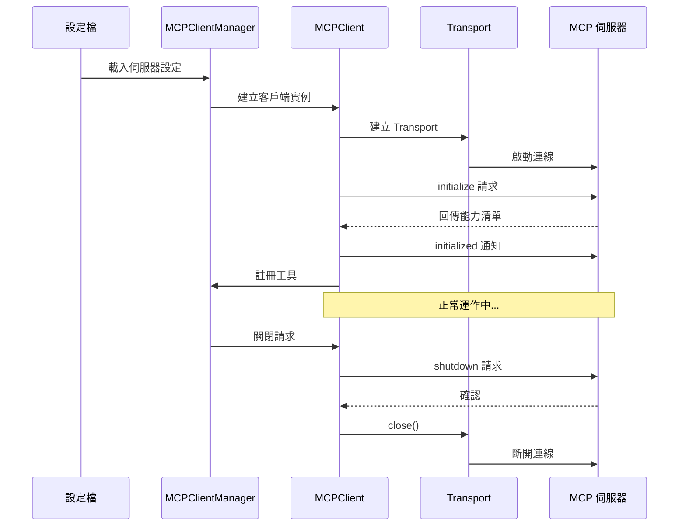
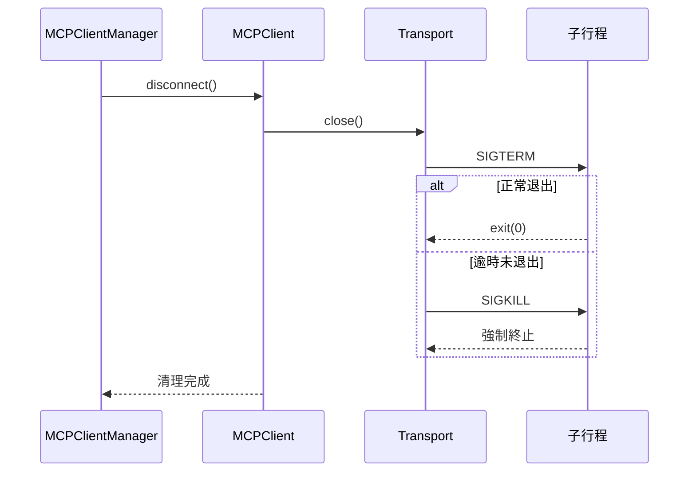

# 伺服器生命週期

**原始碼**: `src/services/mcp/client.ts`、`src/services/mcp/config.ts`

## 概述

每個 MCP 伺服器從設定發現到優雅關閉，經歷完整的生命週期。系統管理連線狀態轉換、能力協商、健康監控和故障復原。

## 全生命週期序列圖



## 發現階段

系統從多個層級載入 MCP 伺服器設定並進行合併：

1. **全域設定** — `~/.claude/settings.json` 中的 `mcpServers`
2. **專案設定** — `.claude/settings.json` 中的專案專屬伺服器
3. **企業設定** — 受管理環境中的企業級設定

設定合併遵循優先順序：企業 > 專案 > 全域。相同名稱的伺服器，高優先順序覆蓋低優先順序。

## 啟動階段

伺服器啟動時，系統根據設定建立對應的 Transport：

- **command** — 要執行的程式路徑或名稱
- **args** — 傳遞給程式的命令列引數陣列
- **env** — 注入子行程的環境變數（與父行程環境合併）
- **url** — 遠端伺服器的連線 URL（SSE/Streamable HTTP）

```json
{
  "mcpServers": {
    "github": {
      "command": "npx",
      "args": ["-y", "@modelcontextprotocol/server-github"],
      "env": { "GITHUB_TOKEN": "ghp_..." }
    }
  }
}
```

## 握手階段

Transport 建立後，客戶端執行 MCP 協議握手：

1. 客戶端傳送 `initialize` 請求，包含支援的協議版本和客戶端能力
2. 伺服器回應其支援的協議版本和能力清單
3. 客戶端傳送 `initialized` 通知，確認握手完成

## 能力交換


| 能力類型 | 說明 |
|----------|------|
| **tools** | 伺服器提供的可呼叫工具 |
| **resources** | 可讀取的資料資源 |
| **prompts** | 預定義的提示模板 |
| **logging** | 伺服器日誌推播 |
| **experimental** | 實驗性功能 |

握手完成後，客戶端呼叫 `tools/list` 取得工具清單，並將每個工具轉換為 Claude Code 內部工具格式進行註冊。

## 健康監控

系統持續監控伺服器連線狀態：

- **行程監控** — 偵測子行程意外退出（exit 事件）
- **Transport 監控** — 偵測連線中斷（onclose 事件）
- **錯誤計數** — 追蹤連續錯誤次數，超過閾值標記為不健康
- **心跳** — 部分 Transport 支援定期 ping 確認連線

## 優雅關閉



關閉流程先傳送 SIGTERM，逾時後強制 SIGKILL。

## 重啟復原

伺服器意外崩潰時，系統透過指數退避自動復原：偵測崩潰 → 退避等待（1s~30s）→ 重建 Transport → 重新握手 → 重新註冊工具。

## 設計模式

| 模式 | 應用 |
|------|------|
| **狀態機** | 伺服器連線狀態轉換（發現→啟動→握手→就緒→關閉） |
| **觀察者模式** | Transport 事件驅動的狀態變更通知 |
| **指數退避重試** | 崩潰後自動重啟的等待策略 |
| **策略模式** | 設定合併的優先順序策略 |

## 相關頁面

- [客戶端架構](./client-architecture) — Transport 抽象和多伺服器管理
- [工具註冊](./tool-registration) — 握手後的工具註冊流程
