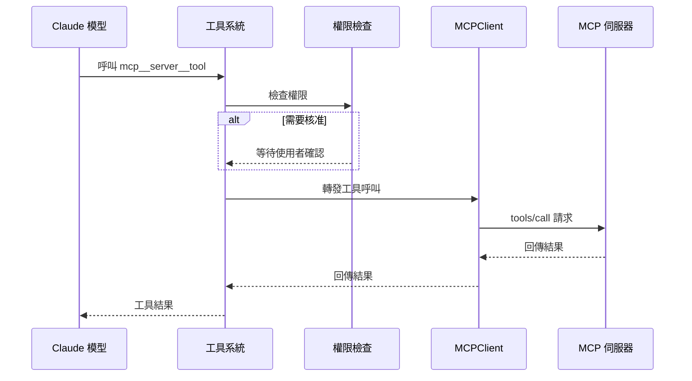

# 工具註冊

**原始碼**: `src/services/mcp/`

## 概述

MCP 伺服器提供的工具必須經過註冊管線轉換，才能成為 Claude Code 可用的內部工具。此過程涉及 Schema 映射、命名空間隔離和權限整合。

## 註冊管線


伺服器握手完成後，客戶端呼叫 `tools/list` 取得伺服器提供的所有工具。每個工具經過以下管線處理後，註冊到 Claude Code 的統一工具系統中。

## Schema 映射

MCP 工具使用 JSON Schema 定義輸入參數。註冊時，系統將 MCP 的工具定義轉換為 Claude Code 的內部工具格式：

```typescript
// MCP 工具定義
{
  name: "read_file",
  description: "Read a file from the filesystem",
  inputSchema: {
    type: "object",
    properties: {
      path: { type: "string", description: "File path" }
    },
    required: ["path"]
  }
}

// 轉換為 Claude Code 內部工具格式
{
  name: "mcp__filesystem__read_file",
  description: "Read a file from the filesystem",
  inputSchema: { /* 保持原始 JSON Schema */ },
  // 附加中繼資料
  source: "mcp",
  serverName: "filesystem",
  originalName: "read_file"
}
```

JSON Schema 的 `inputSchema` 直接透傳給模型，確保參數驗證的一致性。

## 工具命名

所有 MCP 工具使用三段式命名格式，確保全域唯一性：

```
mcp__{serverName}__{toolName}
```

| 組成部分 | 說明 | 範例 |
|----------|------|------|
| 前綴 | 固定為 `mcp` | `mcp` |
| 伺服器名稱 | 設定中的伺服器鍵名 | `github` |
| 工具名稱 | 伺服器提供的原始工具名稱 | `create_issue` |

完整範例：`mcp__github__create_issue`、`mcp__filesystem__read_file`

此命名空間機制防止不同伺服器提供相同名稱工具時的衝突。

## 權限整合

MCP 工具繼承 Claude Code 的權限系統：

- **預設需要核准** — 所有 MCP 工具預設需要使用者確認才能執行
- **允許清單** — 使用者可在設定中將特定工具加入允許清單
- **頻道權限** — `channelPermissions.ts` 管理每個工具的權限等級
- **伺服器級別** — 可對整個伺服器設定統一的權限策略

```json
{
  "permissions": {
    "allow": [
      "mcp__filesystem__read_file",
      "mcp__github__*"
    ]
  }
}
```

## 工具執行流程



## 資源與 Prompt 註冊

除了工具，MCP 伺服器也可以提供：

- **資源（Resources）** — 透過 `resources/list` 和 `resources/read` 存取，每個資源由唯一 URI 識別，攜帶 MIME 型別
- **Prompt 模板** — 透過 `prompts/list` 和 `prompts/get` 存取，支援參數動態填充，由使用者明確觸發

## 動態更新

MCP 協議支援工具清單的動態變更：

1. **伺服器通知** — 伺服器傳送 `notifications/tools/list_changed`
2. **重新載入** — 客戶端呼叫 `tools/list` 取得最新清單
3. **差異更新** — 比對新舊清單，增刪註冊表項目
4. **即時生效** — 新工具立即可用，移除的工具立即失效

## 設計模式

| 模式 | 應用 |
|------|------|
| **註冊表模式** | 集中管理所有已註冊工具的查詢與存取 |
| **適配器模式** | MCP 工具格式轉換為 Claude Code 內部格式 |
| **命名空間模式** | 三段式命名防止工具名稱衝突 |
| **代理模式** | 工具呼叫透過客戶端代理轉發到伺服器 |

## 相關頁面

- [客戶端架構](./client-architecture) — Transport 層如何傳遞工具呼叫
- [伺服器生命週期](./server-lifecycle) — 握手階段的能力交換
