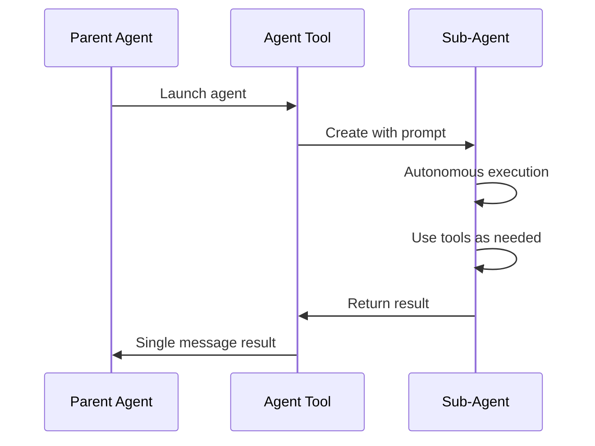

# Agent 工具

**原始碼**: `src/tools/AgentTool/`

## 概述

Agent 工具使 Claude Code 能夠生成子代理 — 獨立的 Claude 例項，自主處理複雜的多步驟任務。這是多代理架構的基礎。

## 引數

- **prompt** — 子代理的任務描述
- **description** — 簡短（3-5 詞）摘要
- **subagent_type** — 代理專業化型別（可選）
- **run_in_background** — 非同步執行（可選）
- **isolation** — 隔離模式，如 `"worktree"`（可選）
- **resume** — 要恢復的代理 ID（可選）

## 代理型別

| 型別 | 可用工具 | 使用場景 |
|------|---------|---------|
| `general-purpose` | 所有工具 | 複雜多步驟任務 |
| `Explore` | 只讀工具 | 程式碼庫探索 |
| `Plan` | 只讀工具 | 實現規劃 |
| `statusline-setup` | Read, Edit | 狀態列配置 |

## 執行模型

## 隔離模式

### 預設
子代理與父代理在同一目錄工作。

### Worktree
`isolation: "worktree"` 建立臨時 git worktree，給子代理一個隔離的倉庫副本。更改可以保留或丟棄。

## 後臺執行

代理可以在後臺執行，父代理繼續工作：

- 使用 `run_in_background: true` 啟動
- 代理完成時通知父代理
- 多個代理可以並行執行

## 恢復代理

代理可以使用其 ID 恢復，保留完整的先前上下文。這使得跨多個回合的迭代工作流成為可能。
