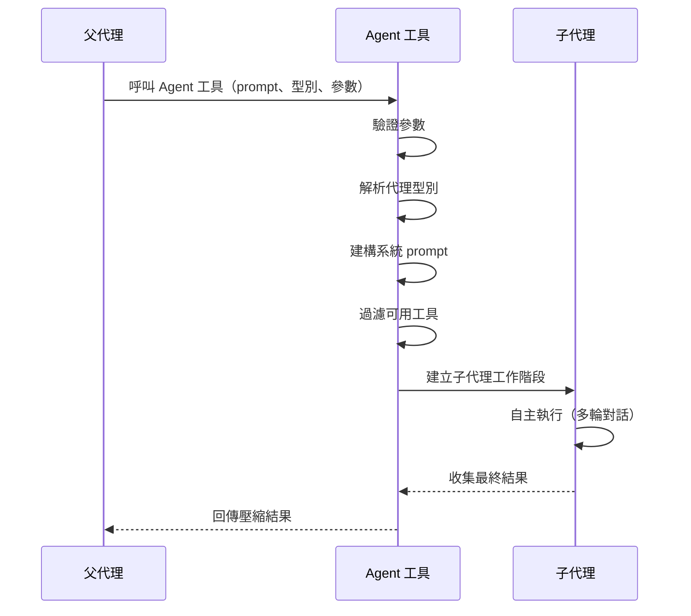
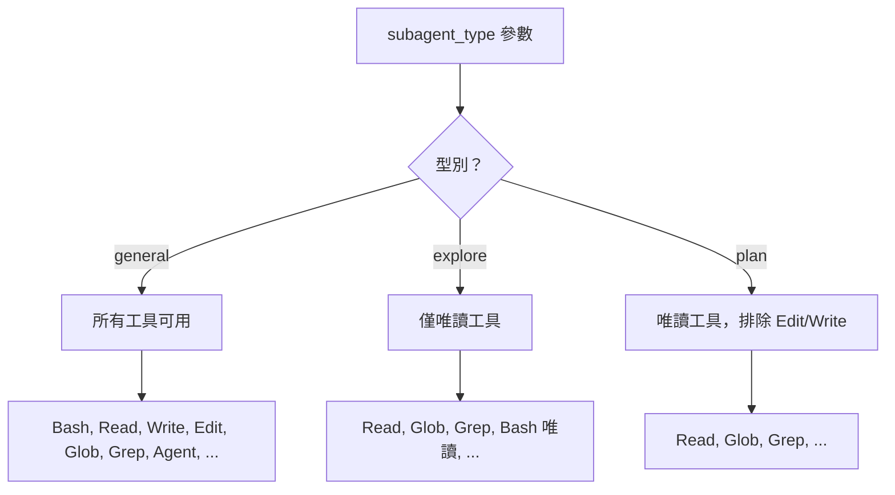

# 代理生命週期

Agent 工具從父代理發出請求到壓縮結果回傳，遵循精確的生命週期流程。理解此生命週期對於推理子代理行為、prompt 建構和資源管理至關重要。

## 生命週期總覽



父代理不會直接控制子代理的執行。一旦啟動，子代理將自主運行直到完成或達到資源限制。

## Prompt 建構

子代理的系統 prompt 以分層方式建構：

1. **繼承基底**：父代理的系統 prompt 被攜帶，保留專案上下文、記憶檔案和環境細節。
2. **代理專屬指令**：根據代理型別附加額外指令（例如為 Explore 代理添加唯讀約束）。
3. **任務 prompt**：呼叫者提供的 `prompt` 參數成為子代理的初始使用者訊息。

```ts
// 簡化的 prompt 建構流程
const systemPrompt = [
  parentSystemPrompt,       // 繼承的上下文
  agentTypeInstructions,    // 型別專屬規則
  isolationInstructions,    // worktree/CWD 上下文
].join("\n");
```

子代理與父代理共享 **prompt 快取**，這表示常見的系統 prompt 片段不需要重新分詞。這顯著降低了子代理首輪對話的延遲。

## 工具過濾

可用工具根據解析後的代理型別進行過濾：



| 代理型別 | 包含工具 | 使用場景 |
|----------|---------|---------|
| `general` | 所有父代理工具 | 完整自主工作 |
| `explore` | 唯讀子集 | 程式碼調查、搜尋 |
| `plan` | 唯讀（排除編輯/寫入） | 規劃、分析 |

工具過濾確保子代理不會超出其預定範圍。Explore 代理在物理上無法呼叫 Write 工具 -- 該工具在工作階段開始前即被移除。

## 上下文隔離

每個子代理擁有獨立的**對話歷史**。父代理的對話訊息對子代理不可見，子代理的內部輪次對父代理同樣不可見。

關鍵隔離屬性：

- **對話**：每個子代理擁有獨立的訊息歷史
- **Prompt 快取**：與父代理共享（效能最佳化）
- **工作目錄**：共享或隔離（參見[隔離與 Worktree](/zh-TW/tools/agent-tool/isolation-and-worktrees)）
- **Token 預算**：每個子代理獨立計算

## 結果處理

子代理完成時，其整個多輪對話被**壓縮為單條訊息**回傳給父代理：

```
子代理結果：
  - 找到 3 個符合模式的檔案
  - src/utils/parser.ts 包含目標函式
  - 該函式接受兩個參數：input（string）和 options（object）
```

父代理不會看到：
- 子代理的中間工具呼叫
- 子代理的內部推理過程
- 子代理經歷了多少輪對話

此壓縮機制充當**外觀模式（Facade）** -- 無論子代理內部複雜度如何，父代理都透過簡單的結果介面互動。

## 資源限制

子代理在獨立的資源約束下運行：

- **Token 預算**：每個子代理有獨立的 token 限制。超出限制將終止代理，並回傳可用的部分結果。
- **輪次限制**：最大對話輪次數防止失控執行。
- **時間**：背景代理可長時間執行，但前景代理會阻塞父代理。

當子代理因資源限制被終止時，父代理會收到截斷結果，並附帶代理未正常完成的指示。

## 設計模式

Agent 工具生命週期採用了多個設計模式：

### 工廠模式（Factory）
代理型別參數充當工廠選擇器。同一個 Agent 工具根據型別建立不同的配置：

```
AgentTool.invoke({ type: "explore" })  → ReadOnlyAgentConfig
AgentTool.invoke({ type: "general" }) → FullAgentConfig
```

### 外觀模式（Facade）
壓縮後的單條訊息結果將子代理的多輪內部執行隱藏在簡單介面之後。無論子代理執行了 2 輪還是 20 輪，父代理只看到一個結果。

### 策略模式（Strategy）
不同的代理型別為相同的「調查並報告」任務實作不同的策略。Explore 策略限制工具；General 策略提供完整存取。生命週期機制保持一致 -- 只有工具集和 prompt 不同。

---

生命週期設計確保子代理是可預測、有界限且可組合的。父代理可以啟動多個不同型別的子代理，每個子代理在明確的約束下運行，並接收統一格式的結果。
