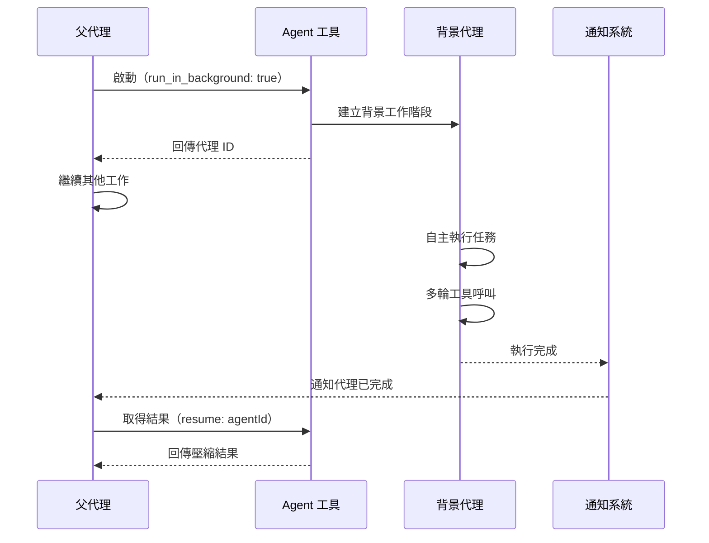
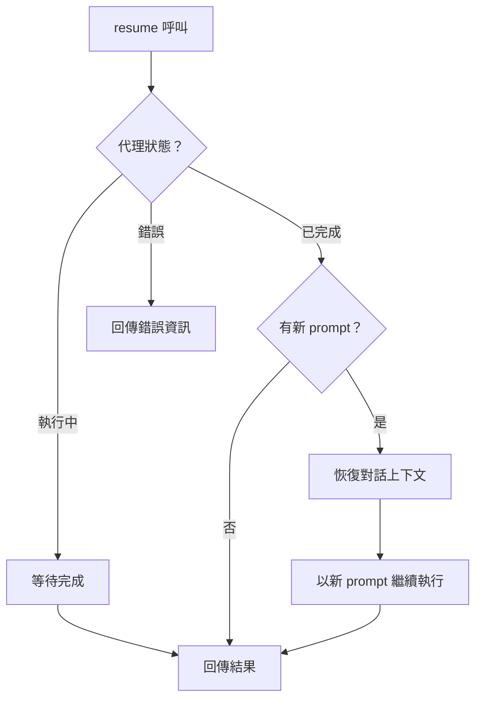

# 背景執行

Agent 工具支援在背景非同步執行子代理，讓父代理在子代理工作期間繼續處理其他任務。這為平行工作流和長時間執行任務提供了基礎。

## 背景代理生命週期



## 啟動機制

背景代理透過 `run_in_background: true` 參數啟動：

```ts
// 啟動背景代理
const result = await agentTool.invoke({
  prompt: "搜尋所有使用已棄用 API 的檔案並列出清單",
  subagent_type: "explore",
  run_in_background: true,
});
// result 立即回傳代理 ID，而非最終結果
```

啟動流程：

1. Agent 工具驗證參數並建構 prompt
2. 建立獨立的子代理工作階段
3. 將代理放入背景執行佇列
4. **立即回傳代理 ID** 給父代理
5. 子代理在背景非同步開始執行

父代理不會被阻塞 -- 它在收到代理 ID 後立即恢復自己的工作流。

## 通知系統

背景代理完成時，通知系統負責告知父代理：

- **完成通知**：代理正常完成時觸發
- **錯誤通知**：代理因錯誤終止時觸發
- **資源耗盡通知**：代理達到 token 或輪次限制時觸發

通知訊息包含代理 ID 和完成狀態，讓父代理決定何時取得結果。

## 平行執行

多個背景代理可以同時執行，實現真正的平行工作：

```ts
// 平行啟動多個背景代理
const agent1 = await agentTool.invoke({
  prompt: "分析 src/api/ 目錄的程式碼品質",
  run_in_background: true,
});

const agent2 = await agentTool.invoke({
  prompt: "檢查 src/utils/ 的測試覆蓋率",
  run_in_background: true,
});

// 父代理繼續工作，稍後取得結果
```

每個背景代理有獨立的 token 預算。預設模式下檔案存取受單寫鎖約束，平行寫入場景建議搭配 worktree 隔離。

## 結果取得

父代理透過 `resume` 參數取得背景代理的結果：

```ts
// 取得背景代理結果
const result = await agentTool.invoke({
  resume: agentId,
});
```

如果代理尚未完成，resume 呼叫會等待代理完成後再回傳結果。

## 恢復機制

`resume` 參數不僅用於取得結果，還可以恢復已完成代理的對話，進行追加互動：



恢復機制的關鍵特性：

- **上下文保留**：恢復的代理保留完整的先前對話歷史
- **狀態延續**：工作目錄和環境狀態維持不變
- **迭代工作流**：支援跨多個回合的漸進式任務完成

```ts
// 恢復代理並追加指令
const followUp = await agentTool.invoke({
  prompt: "基於之前的分析結果，產生修復建議",
  resume: previousAgentId,
});
```

## 資源管理

- **記憶體**：每個背景代理維護獨立的對話歷史
- **Token 預算**：獨立計算，不與父代理共享
- **檔案控制代碼**：worktree 模式下需管理額外的 Git 物件
- **清理**：代理完成後，相關資源自動清理

## 設計模式

### 非同步模式（Async）
背景執行是經典的非同步模式實作。啟動操作立即回傳一個控制代碼（代理 ID），實際工作在背景進行，結果透過後續呼叫取得。

### 觀察者模式（Observer）
通知系統採用觀察者模式。背景代理完成時發布事件，父代理作為訂閱者接收通知並決定後續動作。

### 備忘錄模式（Memento）
恢復機制體現備忘錄模式。代理的完整對話狀態被保存，允許在稍後的時間點恢復到先前的上下文，繼續執行新的任務。

---

背景執行使 Agent 工具從同步阻塞模式擴展為全面的非同步工作流引擎。結合 worktree 隔離，多個背景代理可以安全地平行工作，大幅提升複雜任務的處理效率。
