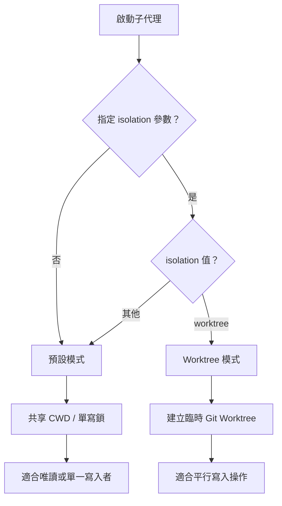
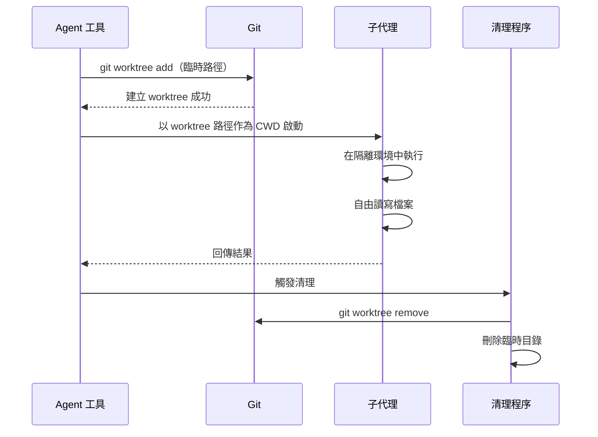

# 隔離與 Worktree

子代理可以在兩種隔離模式下運行：預設的共享工作目錄模式，以及透過 Git worktree 實現完整檔案系統隔離的模式。隔離模式的選擇直接影響子代理之間的檔案衝突風險和平行執行能力。

## 隔離模式決策



## 預設模式：共享 CWD

在預設模式下，子代理與父代理共享同一工作目錄。這是最簡單的模式，適用於大多數場景。

### 運作方式

- 子代理在父代理相同的 `cwd` 中執行
- 對檔案系統的更改立即對父代理可見
- 多個子代理同時寫入可能導致衝突

### 單寫鎖

為防止並行寫入衝突，共享模式使用**單寫鎖（Single-Writer Lock）**機制：

- 同一時間僅允許一個代理執行寫入操作
- 唯讀代理（如 Explore 型別）可自由平行執行
- 寫入鎖在工具呼叫層級獲取和釋放

```ts
// 概念性的單寫鎖機制
if (tool.isWriteOperation) {
  await acquireWriteLock(cwd);
  try {
    await tool.execute();
  } finally {
    releaseWriteLock(cwd);
  }
}
```

## Worktree 模式

當指定 `isolation: "worktree"` 時，Agent 工具為子代理建立一個臨時的 Git worktree，提供完全隔離的檔案系統環境。

### Worktree 生命週期



### Worktree 建立細節

建立 worktree 時執行以下步驟：

1. **產生臨時路徑**：在 `.claude/worktrees/` 目錄下建立唯一路徑
2. **建立分支**：基於當前 HEAD 建立臨時分支
3. **添加 worktree**：執行 `git worktree add <path> -b <branch>`
4. **設定 CWD**：將子代理的工作目錄指向 worktree 路徑

```ts
// Worktree 建立流程
const worktreePath = path.join(repoRoot, ".claude/worktrees", uniqueId);
await exec(`git worktree add ${worktreePath} -b ${tempBranch}`);
subAgent.cwd = worktreePath;
```

### 檔案系統隔離

Worktree 模式提供以下隔離保證：

| 面向 | 行為 |
|------|------|
| 檔案讀取 | 讀取 worktree 副本 |
| 檔案寫入 | 僅影響 worktree 副本 |
| Git 狀態 | 獨立的分支和暫存區 |
| 相依性 | 共享 `node_modules`（透過符號連結或根層級） |

子代理在 worktree 中的所有更改不會影響主工作目錄。這使得多個子代理可以安全地平行寫入不同的 worktree。

## 清理機制

Worktree 的清理採用 **RAII（資源取得即初始化）** 模式：

- **正常完成**：子代理結束後自動移除 worktree 和臨時分支
- **異常終止**：透過 finally 區塊確保清理執行
- **殘留清理**：啟動時掃描 `.claude/worktrees/` 並移除過期的 worktree

```ts
// RAII 風格的清理
try {
  const result = await runSubAgent(worktreePath);
  return result;
} finally {
  await exec(`git worktree remove ${worktreePath} --force`);
  await exec(`git branch -D ${tempBranch}`);
}
```

### 保留更改

子代理提交到臨時分支的更改可以被保留 -- 父代理可以合併或 cherry-pick 這些提交。清理程序不會刪除有未合併提交的分支（除非強制執行）。

## 衝突預防

| 策略 | 預設模式 | Worktree 模式 |
|------|---------|--------------|
| 寫入衝突 | 單寫鎖 | 檔案系統隔離 |
| Git 衝突 | 共享索引 | 獨立索引 |
| 平行安全 | 需要協調 | 天然隔離 |

## 設計模式

### 模板方法模式（Template Method）
隔離模式的選擇遵循模板方法模式 -- 生命週期步驟（建立、執行、清理）是固定的，但每個步驟的具體實現根據隔離模式而異。

### RAII 模式
Worktree 的建立和清理嚴格遵循 RAII 原則。worktree 在代理啟動時建立，在代理結束時（無論正常或異常）保證被清理，防止資源洩漏。

---

選擇隔離模式時，唯讀任務和簡單寫入任務適合預設模式；需要平行寫入或實驗性更改的場景應使用 worktree 模式。
