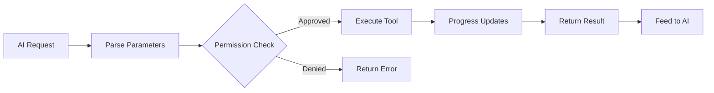

# 工具系統

**原始碼**: `src/Tool.ts` (792 行) 和 `src/tools/`（45+ 子目錄）

## 概述

工具是 Claude Code 與使用者環境互動的主要機制。每個工具都有定義的介面、輸入模式和執行行為。

## 工具介面

每個工具實現 `src/Tool.ts` 中定義的標準介面：

- **name** — 唯一識別符號（如 `"Bash"`、`"Read"`、`"Edit"`）
- **description** — AI 使用的自然語言描述
- **inputSchema** — 定義接受引數的 JSON Schema
- **execute** — 執行工具操作的非同步函式
- **permissions** — 所需的許可權級別

## 工具生命週期

## 工具分類

| 分類 | 工具 | 描述 |
|------|------|------|
| **檔案操作** | Read, Edit, Write, Glob, Grep | 檔案系統互動 |
| **執行** | Bash, PowerShell, REPL | 命令執行 |
| **AI 代理** | Agent, Coordinator | 多代理委派 |
| **擴充套件** | MCP, Skill | 外部工具整合 |
| **任務** | TaskCreate, TaskUpdate, TaskGet, TaskList, TaskStop | 任務管理 |
| **規劃** | EnterPlanMode, ExitPlanMode | 結構化規劃工作流 |
| **工作區** | EnterWorktree, ExitWorktree | Git worktree 隔離 |
| **筆記本** | NotebookEdit | Jupyter 筆記本支援 |
| **其他** | AskUserQuestion, Sleep, ScheduleCron | 實用工具 |

## 輸入模式

工具使用 JSON Schema（`ToolInputJSONSchema`）定義引數。此模式作為工具定義的一部分傳送給 AI，使 AI 能夠構造有效的工具呼叫。

## 進度追蹤

工具在執行過程中透過 `ToolProgressData` 發出進度事件。不同工具型別有專門的進度型別：

- `BashProgress` — Shell 命令輸出流
- `MCPProgress` — MCP 伺服器通訊狀態
- `SkillToolProgress` — 技能執行步驟
