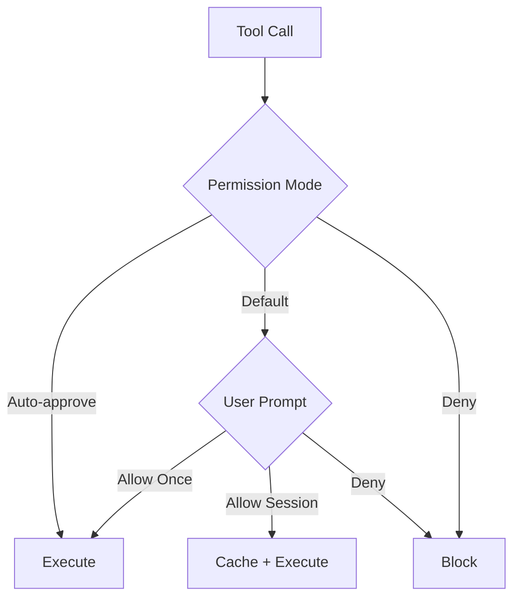

# 工具許可權

**原始碼**: `src/types/permissions.ts` 和 `src/hooks/toolPermission/`

## 概述

Claude Code 實現了細粒度的許可權系統，控制哪些工具可以執行以及在什麼條件下執行。這在保障使用者安全的同時維持了生產力。

## 許可權模式

| 模式 | 行為 |
|------|------|
| **預設** | 每次工具使用都請求批准 |
| **自動批准** | 自動批准匹配的工具 |
| **拒絕** | 阻止工具執行 |

## 許可權流程

## 許可權上下文

每次許可權檢查包含 `ToolPermissionContext`：

- 工具名稱和引數
- 工具是隻讀還是寫入
- 正在執行的具體操作
- 先前的許可權決策

## 許可權 Hooks

`src/hooks/toolPermission/` 目錄包含用於許可權管理的 React hooks：

- **useCanUseTool** — 檢查工具是否可用
- **useToolPermission** — 請求和快取許可權
- 許可權狀態儲存在 AppState 中

## 安全規則

許可權系統強制執行內建安全規則：

- 破壞性操作（rm -rf、git reset --hard）需要明確批准
- 專案目錄外的檔案寫入會被標記
- 金鑰檔案（.env、credentials）受到保護
- 遠端操作（push、deploy）需要確認

## 深入閱讀

- [權限評估](./permission-evaluation) — 完整權限檢查管線：模式解析、規則匹配和快取
- [權限 Hooks](./permission-hooks) — Shell hook 執行、參數修改和自訂策略
- [安全規則](./safety-rules) — 內建安全規則、破壞性操作偵測和機密檔案保護
