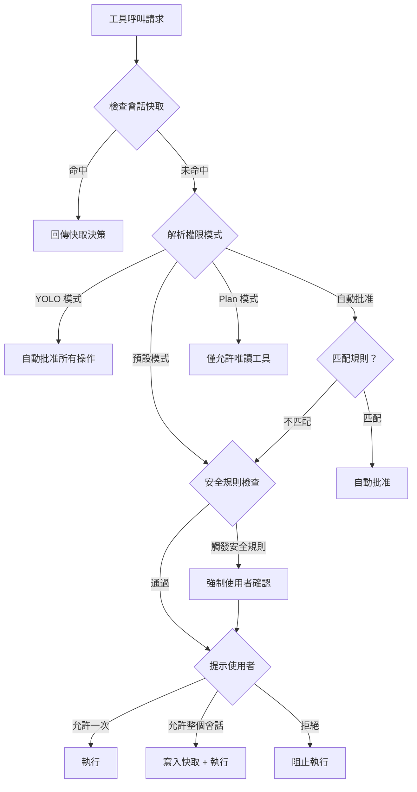
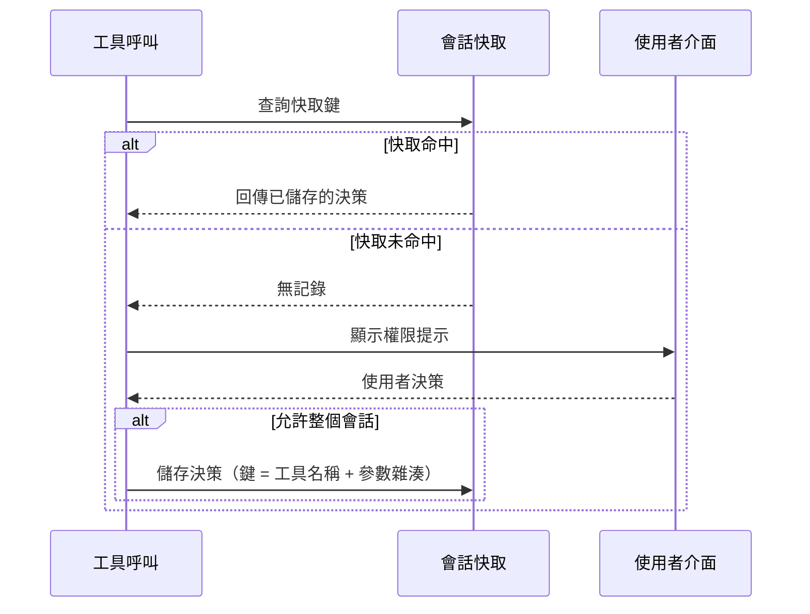

# 權限評估

**原始碼**: `src/types/permissions.ts` 和 `src/hooks/toolPermission/`

權限評估是一條多階段管線，每次工具呼叫都會經過完整的決策鏈。從模式解析到規則匹配再到快取查詢，每個階段都有明確的職責和退出條件。

## 完整決策樹



## 權限模式

系統支援四種權限模式，每種模式提供不同層級的自動化：

| 模式 | 行為 | 適用場景 |
|------|------|---------|
| **預設模式** | 每次工具呼叫都請求使用者批准 | 生產環境、敏感操作 |
| **自動批准** | 符合規則的工具自動執行 | 日常開發、信任的工具 |
| **Plan 模式** | 僅允許唯讀工具，阻止所有寫入 | 程式碼審查、分析任務 |
| **YOLO 模式** | 跳過所有權限檢查，自動批准一切 | 本地實驗、快速原型開發 |

## 模式解析

模式按以下優先順序解析（高到低）：

1. **CLI 旗標**：`--dangerously-skip-permissions`（YOLO）、`--auto-approve`
2. **環境變數**：`CLAUDE_AUTO_APPROVE_TOOLS`、`CLAUDE_PERMISSION_MODE`
3. **settings.json 設定**：`permissions.mode`、`permissions.autoApprove`
4. **預設值**：預設模式（逐次確認）

```ts
// 模式解析的簡化邏輯
function resolvePermissionMode(config: Config): PermissionMode {
  if (config.cliFlags.dangerouslySkipPermissions) return "yolo";
  if (config.env.CLAUDE_PERMISSION_MODE) return config.env.CLAUDE_PERMISSION_MODE;
  if (config.settings.permissions?.mode) return config.settings.permissions.mode;
  return "default";
}
```

## 規則匹配

自動批准模式下，工具呼叫與預設規則進行匹配。支援三種匹配策略：

| 匹配方式 | 語法範例 | 說明 |
|----------|---------|------|
| **精確匹配** | `"Read"` | 完全匹配工具名稱 |
| **Glob 模式** | `"Bash(npm *)"` | 使用萬用字元匹配命令模式 |
| **正則表示式** | `"/^Bash\(git (status|log)\)$/"` | 完整正則匹配 |

規則按宣告順序評估，第一條匹配的規則決定結果。如果沒有規則匹配，回退到使用者確認流程。

## 會話快取

當使用者選擇「允許整個會話」時，決策被快取以避免重複提示：



### 快取鍵結構

快取鍵由工具名稱和關鍵參數的雜湊值組成：

```ts
// 快取鍵範例
const cacheKey = `${toolName}:${hashParams(relevantParams)}`;
// "Bash:a1b2c3"  → 特定命令模式
// "Write:d4e5f6" → 特定檔案路徑
```

### 快取失效

快取在以下情況失效：

- **會話結束**：快取綁定到當前會話，重新啟動後清除
- **模式切換**：權限模式變更時清除所有快取
- **安全規則變更**：安全規則更新時快取失效

## 權限上下文

每次權限檢查攜帶完整的上下文資訊：

```ts
interface ToolPermissionContext {
  toolName: string;           // 工具名稱（如 "Bash"、"Write"）
  params: Record<string, any>; // 工具參數
  isReadOnly: boolean;         // 是否為唯讀操作
  action: string;              // 具體操作描述
  previousDecisions: Decision[]; // 同一會話的歷史決策
  workingDirectory: string;    // 當前工作目錄
}
```

此上下文在管線的每個階段都可用，讓規則匹配和安全檢查能夠根據完整的執行環境做出決策。

## 設計模式

### 責任鏈（Chain of Responsibility）
權限評估管線是典型的責任鏈：快取 → 模式檢查 → 規則匹配 → 安全規則 → 使用者確認。每個階段可以終止鏈條並回傳決策，或將請求傳遞給下一階段。

### 策略模式（Strategy）
四種權限模式代表四種不同的評估策略。模式解析後，對應的策略決定後續的評估流程。

### 旁路快取（Cache-Aside）
會話快取採用旁路快取模式 -- 先查詢快取，未命中時執行完整評估，再將結果寫入快取。快取對管線透明，移除快取不影響正確性。

---

多階段管線設計確保每次工具呼叫都經過一致的安全評估，同時透過快取和自動批准規則最小化對使用者工作流程的干擾。
