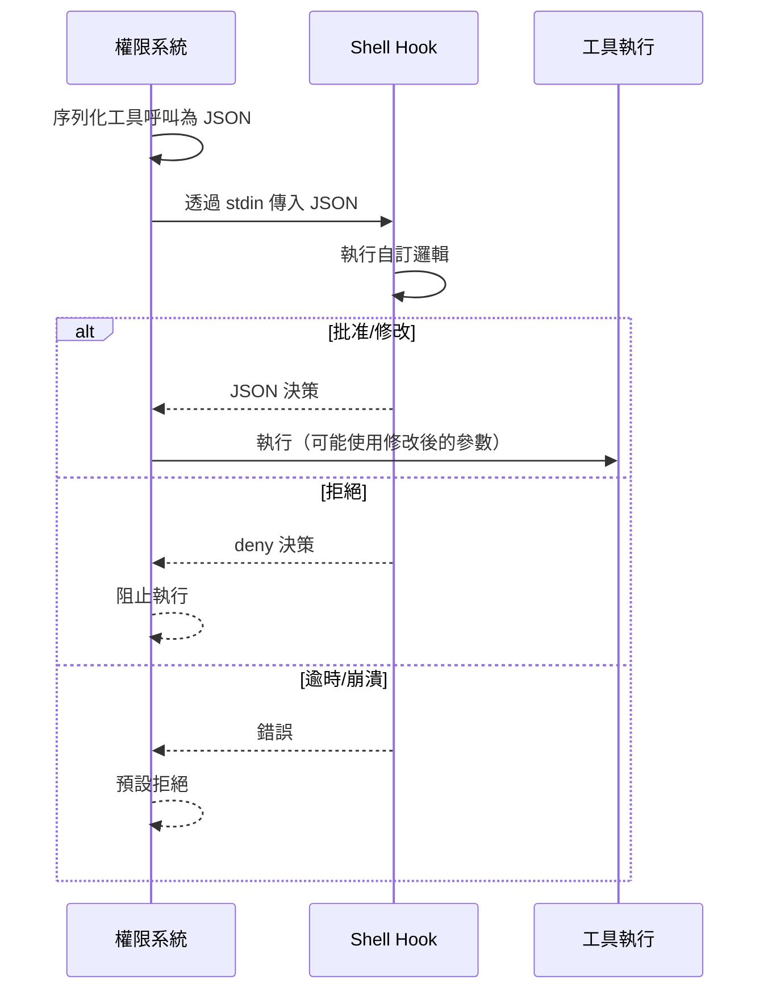

# 權限 Hooks

**原始碼**: `src/hooks/toolPermission/`

權限 Hooks 是使用者可設定的 shell 命令，在工具呼叫的關鍵時刻執行。透過 hooks，使用者可以實現自訂審批邏輯、記錄工具使用、修改參數或強制執行組織策略。

## Hook 執行流程



## Hook 設定

Hooks 在 `settings.json` 中設定：

```json
{
  "permissions": {
    "hooks": [{
      "event": "tool_call",
      "command": "/usr/local/bin/approval-gate",
      "timeout": 5000,
      "env": { "POLICY_SERVER": "https://policy.internal.corp" }
    }]
  }
}
```

| 欄位 | 型別 | 說明 |
|------|------|------|
| `event` | `string` | 觸發事件（見下方事件型別） |
| `command` | `string` | 要執行的 shell 命令 |
| `timeout` | `number` | 逾時毫秒數（預設 5000） |
| `env` | `object` | 傳遞給命令的額外環境變數 |

## Hook 事件型別

| 事件 | 觸發時機 | 用途 |
|------|---------|------|
| `tool_call` | 工具呼叫被請求時（權限檢查階段） | 審批、記錄、策略執行 |
| `pre_execute` | 權限通過後、工具執行前 | 參數修改、最終驗證 |
| `post_execute` | 工具執行完成後 | 審計記錄、結果驗證 |

## Hook 輸入

系統透過 stdin 向 hook 命令傳入 JSON 格式的工具呼叫資訊：

```json
{
  "event": "tool_call",
  "tool": "Bash",
  "params": { "command": "npm install lodash" },
  "context": {
    "workingDirectory": "/home/user/project",
    "isReadOnly": false
  }
}
```

## Hook 輸出

Hook 命令透過 stdout 回傳 JSON 決策。最簡形式：`{"decision": "approve"}`

### 決策格式

| decision 值 | 行為 |
|-------------|------|
| `"approve"` | 批准工具執行 |
| `"deny"` | 阻止工具執行，可選附帶 `reason` |
| `"modify"` | 使用修改後的參數執行，需附帶 `params` |

### 參數修改

`modify` 決策允許 hook 替換工具參數。修改後的參數完全替換原始參數（系統不合併新舊參數）：

```json
{ "decision": "modify", "params": { "command": "npm install lodash --save-exact" } }
```

## 錯誤處理

Hook 失敗採用**預設拒絕**策略：

| 錯誤情境 | 系統行為 |
|----------|---------|
| Hook 逾時 | 記錄警告，拒絕工具呼叫 |
| Hook 程序崩潰（非零退出碼） | 記錄錯誤，拒絕工具呼叫 |
| 輸出格式無效 | 記錄解析錯誤，拒絕工具呼叫 |
| Hook 命令不存在 | 啟動時報錯，跳過該 hook |

此策略確保 hook 失敗不會意外放行危險操作。

## Hook 範例

### 審計記錄 hook

```bash
#!/bin/bash
# audit-hook.sh — 記錄所有工具呼叫
INPUT=$(cat)
echo "$INPUT" >> /var/log/claude-tool-calls.jsonl
echo '{"decision": "approve"}'
```

### 策略閘道 hook

```bash
#!/bin/bash
# policy-gate.sh — 阻止 sudo 命令
INPUT=$(cat)
CMD=$(echo "$INPUT" | jq -r '.params.command // empty')
if echo "$CMD" | grep -q "^sudo"; then
  echo '{"decision": "deny", "reason": "組織策略禁止 sudo"}'; exit 0
fi
echo '{"decision": "approve"}'
```

## 安全考量

- **Hook 本身不受權限系統保護**，設定者需確保 hook 命令安全
- **避免在 hook 中呼叫網路服務**而不設逾時，否則阻塞整個管線
- **Hook 命令繼承 Claude Code 的程序環境**，含所有環境變數和檔案存取權限

## 設計模式

- **攔截器模式（Interceptor）**：在工具執行前後插入自訂邏輯，不修改核心權限系統程式碼。
- **責任鏈（Chain of Responsibility）**：多個 hooks 針對同一事件註冊，按宣告順序執行，任何 `deny` 即終止鏈條。
- **中介軟體模式（Middleware）**：`pre_execute` → 工具執行 → `post_execute` 的流程類似中介軟體管線。

---

權限 Hooks 為組織級別的工具管控提供靈活的擴展點。透過 shell 命令介面，任何能讀寫 JSON 的程式都能參與權限決策。
