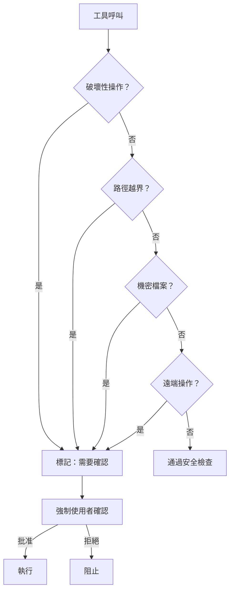
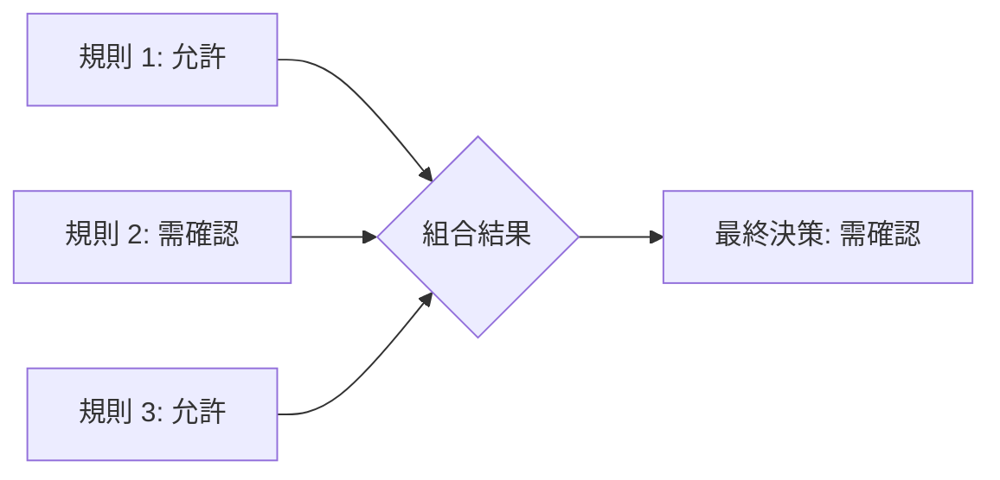

# 安全規則

**原始碼**: `src/types/permissions.ts`

安全規則是權限系統中不可繞過的最後防線。即使在自動批准模式下，匹配安全規則的操作仍然會觸發使用者確認。這些規則保護使用者免受破壞性命令、越界存取和機密洩漏。

## 安全規則評估流程



安全規則的評估獨立於權限模式。即使在 YOLO 模式下，某些核心安全規則仍然生效（可透過 `--dangerously-skip-permissions` 旗標覆蓋）。

## 規則分類

### 破壞性操作偵測

偵測可能造成不可逆損害的命令模式：

| 命令模式 | 風險等級 | 說明 |
|----------|---------|------|
| `rm -rf` | 高 | 遞迴強制刪除 |
| `git reset --hard` | 高 | 丟棄未提交的變更 |
| `git push --force` | 高 | 覆蓋遠端歷史 |
| `git clean -fd` | 中 | 刪除未追蹤檔案 |
| `chmod -R 777` | 中 | 開放所有權限 |
| `> file`（截斷重定向） | 中 | 清空檔案內容 |

偵測使用命令模式匹配，解析命令字串中的關鍵旗標和引數組合：

```ts
// 破壞性模式匹配的簡化邏輯
const destructivePatterns = [
  /\brm\s+(-[a-zA-Z]*r[a-zA-Z]*f|--force\s+--recursive)/,
  /\bgit\s+reset\s+--hard/,
  /\bgit\s+push\s+.*--force/,
  /\bgit\s+clean\s+-[a-zA-Z]*f/,
];
```

### 路徑邊界保護

防止工具存取工作目錄以外的檔案系統：

- **CWD 檢查**：所有檔案路徑必須在當前工作目錄（或其子目錄）內
- **符號連結解析**：透過 `realpath` 解析符號連結，防止透過 symlink 繞過路徑檢查
- **路徑正規化**：移除 `../` 等相對路徑跳脫，確保路徑在邊界內

```ts
// 路徑邊界檢查
function isWithinBoundary(targetPath: string, cwd: string): boolean {
  const resolved = fs.realpathSync(targetPath);
  return resolved.startsWith(cwd);
}
```

### 機密檔案保護

阻止對包含敏感資訊的檔案進行讀取或寫入：

| 檔案模式 | 保護的內容 |
|----------|-----------|
| `.env`、`.env.*` | 環境變數、API 金鑰 |
| `credentials.json` | 服務帳號憑證 |
| `*.pem`、`*.key` | 私鑰檔案 |
| `id_rsa`、`id_ed25519` | SSH 私鑰 |
| `.npmrc`（含 token） | 套件管理器認證 |
| `*.secret` | 自訂機密檔案 |

機密檔案規則作用於讀取和寫入操作。即使是讀取 `.env` 檔案也需要使用者確認，因為內容可能被洩漏到對話歷史中。

### 遠端操作規則

需要確認的遠端操作：

| 操作 | 風險 |
|------|------|
| `git push` | 推送程式碼到遠端倉庫 |
| `npm publish` | 發佈套件到公開 registry |
| `curl -X POST` | 向外部服務傳送資料 |
| `ssh`、`scp` | 遠端存取和檔案傳輸 |

## 規則組合

當多條規則同時匹配一個操作時，系統採用**最嚴格優先**原則：



- 任何一條規則要求確認 → 整體需要確認
- 任何一條規則拒絕 → 整體拒絕
- 所有規則允許 → 整體允許

## 覆蓋機制

安全規則可透過以下方式覆蓋：

1. **單次覆蓋**：使用者在確認提示中選擇「允許」
2. **會話覆蓋**：選擇「允許整個會話」快取決策
3. **設定覆蓋**：在 `settings.json` 中將特定規則加入白名單
4. **全域覆蓋**：`--dangerously-skip-permissions` 旗標（不建議）

覆蓋遵循最小權限原則 -- 覆蓋範圍應盡可能精確，避免使用寬泛的萬用字元。

## 誤報處理

安全規則可能產生誤報（例如 `rm -rf node_modules` 是常見清理操作但觸發破壞性規則）。處理策略：

- **會話快取**：第一次確認後同一會話內不再提示
- **自動批准規則**：將常用安全命令加入自動批准列表

## 設計模式

### 策略模式（Strategy）
每種規則分類（破壞性、邊界、機密、遠端）是一個獨立的策略。新增規則分類只需實現相同的介面，不影響現有規則。

### 白名單/黑名單模式
安全規則本質上是黑名單（預設允許，匹配則攔截），而覆蓋機制提供白名單功能（明確放行特定操作）。兩者結合提供靈活的控制。

### 縱深防禦（Defense in Depth）
安全規則是多層防禦中的一層。即使權限模式設為自動批准，安全規則仍然生效。即使安全規則被覆蓋，使用者仍然可以在執行結果中發現問題。每一層都提供獨立的保護。

---

安全規則的設計理念是「寧可多問一次，也不要放過一個危險操作」。透過模式匹配和分層防禦，系統在不顯著影響生產力的前提下最大化安全保障。
